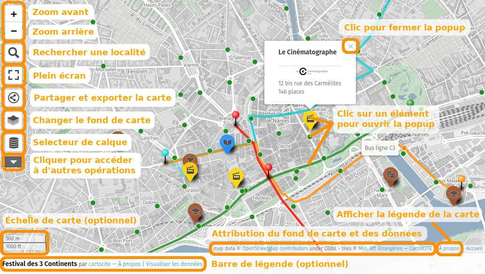
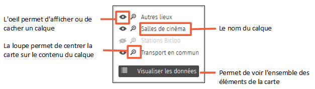
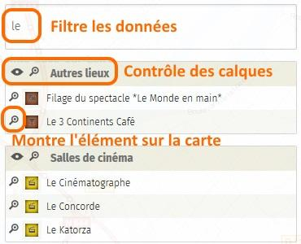

!!! abstract "Ce que nous allons apprendre"

    -   Manipuler une carte uMap
    -   Partager une carte uMap
    -   Connaître les principales fonctionnalités de uMap

## Procédons par étapes

### 1. Manipuler la carte

Vous avez reçu par mail un lien vers une carte uMap. Voici les
principaux éléments de la carte, et les opérations disponibles pour la
manipuler. La carte uMap représentée ci-dessous est disponible
[ici](http://umap.openstreetmap.fr/fr/map/festival-des-3-continents_26381).

À droite de la carte et selon le choix de son auteur peut être affiché
un des deux panneaux suivants :

-   **À propos** : le titre de la carte, une description éventuelle, et
    la liste des calques
-   **Visualiser les données** : l’ensemble des éléments de la carte,
    répartis par calques (voir plus bas)

Le panneau À propos peut être affiché en cliquant sur le mot "À propos",
toujours visible en bas à droite de la carte.

Comme pour la plupart des cartes interactives vous pouvez :

-   déplacer la carte par un glisser-déposer
-   effectuer zooms avant et arrière avec les boutons + et -, ou avec la
    molette de la souris
-   sélectionner un élément de la carte par un clic de la souris :
    apparaît alors une fenêtre *popup* affichant une description de
    l’élément. Celle-ci peut inclure du texte, une image, un lien vers
    un site Web. Dans notre exemple la description de chaque cinéma
    contient une image qui est un lien sur le site Web du cinéma.

**Remarque** : les boutons en haut à gauche de la carte, ainsi que la
barre de légende, peuvent ne pas être disponibles si l’auteur de la
carte a choisi de les cacher.

Voyons maintenant quelques fonctionnalités propres à uMap.

### 2. Le sélecteur de calques

Les éléments d’une carte umap peuvent être répartis dans plusieurs
calques, ou couches. Cela permet de structurer une carte, pour qu’elle
soit plus claire et plus facile à maintenir. L’utilisateur peut choisir
d’afficher ou cacher chaque calque individuellement.

<shot-scraper
    data-output="static/tutoriels/control-browse.png"
    data-url="https://umap.openstreetmap.fr/en/map/new/"
    data-alt="Icône du sélecteur de calque(s)."
    data-selector=".umap-control-browse"
    data-width="48"
    data-height="48"
    data-padding="5"
    >Icône du sélecteur de calque(s).</shot-scraper>

Le sélecteur de calques est
l’icône visible en haut à gauche de la carte sous les boutons de zoom.
Lorsque vous positionnez la souris sur ce bouton, la liste des calques
apparaît, vous pouvez alors afficher ou cacher chaque calque, ou encore
centrer la carte sur le contenu d’un calque.

Dans cet exemple le calque « Stations Bicloo » est caché :
cliquer sur l’oeil de ce calque permet de l’afficher.
La liste des calques, avec éventuellement un descriptif de chaque
calque, est aussi visible dans la légende de la carte.

### 3. Le bouton Plus

<shot-scraper
    data-output="static/tutoriels/control-more.png"
    data-url="https://umap.openstreetmap.fr/en/map/new/"
    data-alt="Icône pour afficher plus d’options."
    data-width="46"
    data-height="33"
    data-selector=".umap-control-more"
    data-padding="5"
    >Icône pour afficher plus d’options.</shot-scraper>

Sous le sélecteur de carte est visible un bouton portant le texte « Plus ».
Un clic sur ce bouton fait apparaître une autre série de boutons.

<shot-scraper
    data-output="static/tutoriels/control-search.png"
    data-url="https://umap.openstreetmap.fr/en/map/new/"
    data-alt="Icône du sélecteur de recherche."
    data-selector=".leaflet-control-search"
    data-width="48"
    data-height="48"
    data-padding="5"
    >Permet de chercher une localité et de centrer la carte dessus :
    saisissez le nom d’une commune et tapez sur `Entrée`</shot-scraper>

<shot-scraper
    data-output="static/tutoriels/control-fullscreen.png"
    data-url="https://umap.openstreetmap.fr/en/map/new/"
    data-alt="Icône de la mise en plein écran."
    data-selector=".leaflet-control-fullscreen"
    data-width="48"
    data-height="48"
    data-padding="5"
    >Place le navigateur en mode plein écran, que l’on peut quitter avec le même
    bouton ou avec la touche `Échap` du clavier.</shot-scraper>

<shot-scraper
    data-output="static/tutoriels/control-embed.png"
    data-url="https://umap.openstreetmap.fr/en/map/new/"
    data-alt="Icône du partage et de l’intégration."
    data-selector=".leaflet-control-embed"
    data-width="48"
    data-height="48"
    data-padding="5"
    >Permet de partager la carte ou d’en exporter les données.
    Un panneau à droite de la carte est affiché, il est expliqué ci-dessous.</shot-scraper>

<shot-scraper
    data-output="static/tutoriels/control-locate.png"
    data-url="https://umap.openstreetmap.fr/en/map/new/"
    data-alt="Icône de la géolocalisation."
    data-selector=".leaflet-control-locate"
    data-width="48"
    data-height="48"
    data-padding="5"
    data-javascript="document.querySelector('.umap-control-more').click()"
    >
    Permet de vous géolocaliser, c’est-à-dire centrer la carte sur votre position
    actuelle. La géolocalisation exige de demander l’autorisation de l’utilisateur,
    votre navigateur Web peut donc vous demander d’accepter ou activer la géolocalisation.
</shot-scraper>

<shot-scraper
    data-output="static/tutoriels/measure-control.png"
    data-url="https://umap.openstreetmap.fr/en/map/new/"
    data-alt="Icône de mesure."
    data-selector=".leaflet-measure-control"
    data-width="48"
    data-height="48"
    data-padding="5"
    data-javascript="document.querySelector('.umap-control-more').click()"
    >
    Est un outil de mesure.
    Activer cet outil a deux effets : d’une part il affiche la longueur
    des éléments linéaires de la carte et l’aire des éléments
    surfaciques ; d’autre part il vous permet de tracer sur la carte une
    ligne dont la longueur est affichée. Cliquez à nouveau sur le bouton
    pour désactiver cet outil.
</shot-scraper>

<shot-scraper
    data-output="static/tutoriels/control-edit-in-osm.png"
    data-url="https://umap.openstreetmap.fr/en/map/new/"
    data-alt="Icône pour éditer les données OpenStreetMap."
    data-selector=".leaflet-control-edit-in-osm"
    data-width="48"
    data-height="48"
    data-padding="5"
    data-javascript="document.querySelector('.umap-control-more').click()"
    >
    Est utile pour améliorer la carte OpenStreetMap - ce qui sort de l’objet de ce tutoriel.
</shot-scraper>

<shot-scraper
    data-output="static/tutoriels/control-icon-layers.png"
    data-url="https://umap.openstreetmap.fr/en/map/new/"
    data-alt="Icône de changement de fond de carte."
    data-selector=".leaflet-iconLayers"
    data-width="48"
    data-height="48"
    data-padding="5"
    data-javascript="document.querySelector('.umap-control-more').click()"
    >
    Affiche plusieurs fonds de carte au survol :
    cliquer sur l’un d’eux change le fond de la carte.</shot-scraper>

#### Partager la carte

Le panneau de partage de la carte offre trois possibilités. Votre choix
dépend de la manière dont vous souhaitez partager la carte :

-   **URL courte** permet de copier une URL abrégée - équivalente à
    l’URL de la carte - que vous pouvez par exemple envoyer dans un
    mail.
-   **Embarquer la carte en iframe** permet d’inclure la carte dans une
    page Web : il suffit de copier le code HTML et de l’insérer dans
    celui de votre page Web. Cette possibilité est explorée en détails
    dans le tutoriel
    [Je publie ma carte et en contrôle l’accès](7-publishing-and-permissions.md).
-   **Télécharger les données** permet d’obtenir les données visibles
    sur la carte, dans différents formats. Cela peut vous permettre
    d’utiliser ces données avec un autre outil.

### 4. Visualiser les données

La liste des éléments de la carte peut être affichée avec un clic sur
**Visualiser les données**, accessible depuis le sélecteur de calques,
la barre de légende, ou encore en haut du panneau Légende.

Le panneau alors visible à droite montre l’ensemble des éléments de la
carte, organisés par calques. La loupe à gauche de chaque élément permet
d’afficher sur la carte la popup décrivant cet élément. Le texte de
saisie au-dessus de la liste permet de rechercher un élément, en ne
montrant que ceux dont le nom contient le texte saisi.

## Faisons le point

Ce premier tutoriel nous a permis de découvrir les principales
fonctionnalités d’une carte uMap. Nous allons maintenant
[apprendre à créer une telle carte](2-first-map.md).

??? info "Licence"

    Travail initié par Antoine Riche sur [Carto’Cité](https://wiki.cartocite.fr/doku.php?id=umap:1_-_je_consulte_une_carte_umap) sous licence [CC-BY-SA 4](https://creativecommons.org/licenses/by-sa/4.0/deed.fr).
