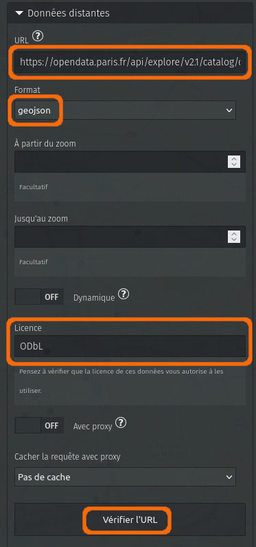
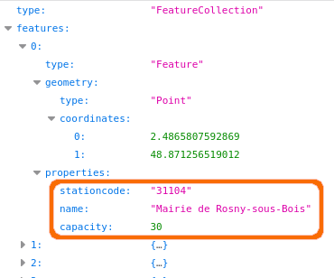
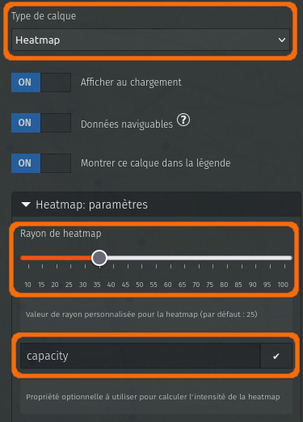
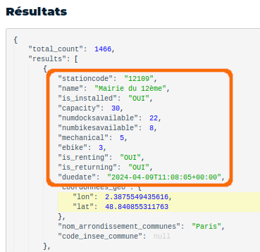
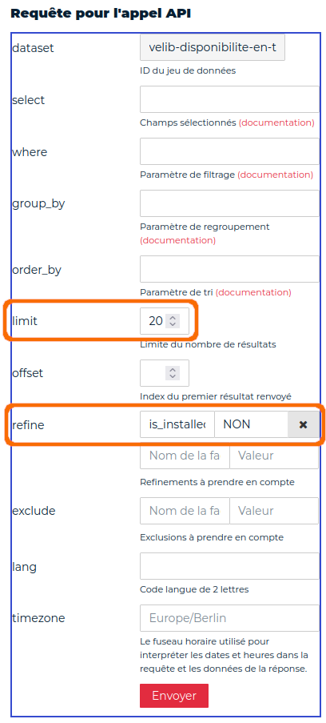
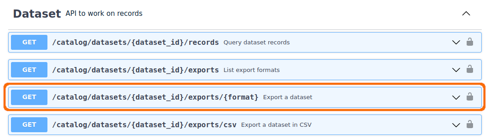
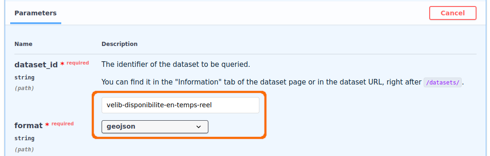
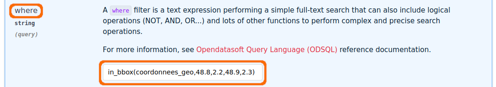
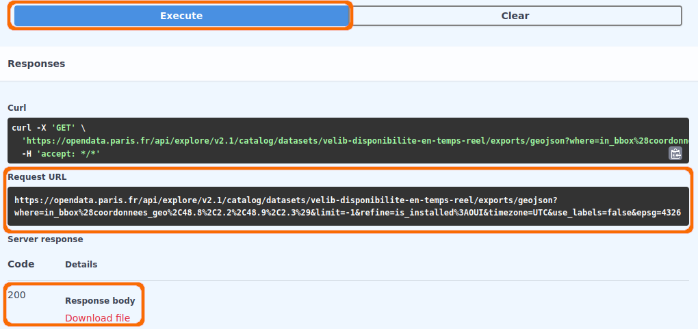

!!! abstract "Ce que nous allons apprendre"

    - Créer un calque qui utilise des données distantes
    - Produire une carte de chaleur (heatmap)
    - Afficher des calques en fonction du niveau de zoom
    - Afficher des données qui évoluent en temps réel
    - Utiliser un portail *open data*
    - Créditer la source des données pour respecter la licence

## Procédons par étapes

Jusqu’ici toutes les cartes que nous avons créées montrent des données
gérées par uMap. Même lorsque nous avons utilisé les données d’un
tableur dans le tutoriel précédent, ces données ont été *importées* sur
le serveur uMap, où elles sont *stockées*. Si ces données sont
modifiées, nous devons de nouveau les importer pour mettre à jour la
carte.

Dans ce tutoriel nous allons apprendre comment créer une carte qui
utilise des **données distantes**, c’est-à-dire stockées sur un autre
serveur que le serveur uMap.

### 1. J’utilise des données distantes

Nous prenons pour ce tutoriel le thème des stations de vélo-partage à
Paris, les fameux Vélib’, dont les données sont disponibles en open
data.

#### Utiliser un portail open data

Commençons par observer le jeu de données « Vélib’ - Localisation et
caractéristique des stations », disponible sur le portail open data de
la ville de Paris :
<https://opendata.paris.fr/explore/dataset/velib-emplacement-des-stations/>.

L’onglet **Informations** explique que les données « sont actualisées
chaque minute selon la norme GBFS 1.0 ». Cette norme décrit plusieurs
fichiers, accessibles avec l’API décrite dans l’onglet **API**, dont le
format n’est pas compris par uMap.

L’onglet **Tableau** montre les données : chaque station a un nom et une
capacité (nombre d’emplacements), ainsi qu’une position géographique.

L’onglet **Export** propose plusieurs formats, dont les formats
**GeoJSON**, **KML** et **GPX**, tous trois compris par uMap. Nous
choisissons le [format GeoJSON](https://fr.wikipedia.org/wiki/GeoJSON),
qui permet d’exploiter tous les attributs présents dans les données.

Une possibilité serait de télécharger le fichier puis de l’importer dans
uMap, comme nous l’avons fait dans le tuto précédent avec un fichier au
format CSV. Outre les manipulations, cela impliquerait de mettre à jour
ces données régulièrement. Nous allons plutôt configurer notre carte
pour accéder directement aux données mises à disposition par le portail
open data. Pour cela nous copions le lien vers le fichier : un clic
droit ouvre un menu contextuel qui permet de **copier le lien** vers le
fichier :

    https://opendata.paris.fr/api/explore/v2.1/catalog/datasets/velib-emplacement-des-stations/exports/geojson?lang=fr&timezone=Europe%2FBerlin

#### Configurer les données distantes

Voyons maintenant comment utiliser ce lien dans uMap. Pour cela nous
créons un nouveau calque et ouvrons, dans les Propriétés du calque,
l’onglet **Données distantes**. Les informations à fournir sont les
suivantes :

-   **URL** : nous collons ici le lien vers le fichier copié
    précédemment.
-   **Format** : nous devons sélectionner le format, ici **geojson**
-   **Licence** : ODbL comme indiqué sur la page d’export du portail
    open data

Le bouton **Vérifier l’URL** permet de tester l’accès au fichier depuis
uMap, et de vérifier que le format choisi correspond bien aux données.
Les données sont alors affichées sur la carte.

#### Proxy ou pas proxy ?

Si cela ne fonctionne pas (uMap affiche un bandeau qui indique «
Problème dans la réponse du serveur »), il est probable que le serveur
sur lequel le fichier est stocké n’autorise pas l’accès au fichier
depuis un service tiers.

!!! note

    Il s’agit du mécanisme CORS, décrit dans l’article
    Wikipédia [Cross-origin ressource
    sharing](https://fr.wikipedia.org/wiki/Cross-origin_resource_sharing).

uMap permet de contourner cette contrainte en faisant transiter le
fichier par le serveur uMap, grâce à l’option **Avec proxy** qu’il
convient alors d’activer. Cette option est associée au menu déroulant
**Cacher la requête avec proxy**, qui permet au serveur uMap de
conserver le fichier afin de ne pas le récupérer à chaque affichage de
la carte. La durée la plus longue (1 jour) serait ici adaptée.

#### Au sujet de la licence

Le fichier des emplacements de stations Vélib’ est publié sous la
[licence ODbL](https://opendatacommons.org/licenses/odbl/). Celle-ci
exige que le producteur des données soit crédité lors de leur
utilisation. Les informations sur le portail open data indique que ce
producteur est « Autolib Velib Métropole ». Il convient donc de le citer
dans les **Crédits** de la carte, un onglet du menu *Propriétés de la
carte*.

#### Afficher le nom et la capacité des stations

Afin d’afficher le nom et la capacité de chaque station dans une
infobulle, nous devons déterminer les clefs permettant d’accéder à ces
informations. Pour cela il nous faut observer le fichier GeoJSON.

Nous téléchargeons ce fichier depuis l’onglet Export du portail open
data, ou collons le lien copié précédemment dans la barre de navigation
du navigateur. Soit le fichier est directement affiché dans le
navigateur, soit il est téléchargé : une possibilité consiste alors à
l’ouvrir dans un éditeur de texte, ou à le déposer dans la fenêtre du
navigateur.

Dans le bloc `properties` de chaque élément, nous observons plusieurs
associations clef-valeur : la propriété **name** contient le nom de la
station, **capacity** contient le nombre d’emplacements. Ces propriétés
correspondent à nos entêtes de colonnes d’un fichier CSV (cf. tuto
précédent).

Nous pouvons alors configurer le **Gabarit de la popup** pour afficher
ces informations dans l’infobulle de chaque station, comme nous l’avons
vu dans le [tuto précédent](9-map-from-spreadsheet.md).

Par exemple :

    # {name}
    {capacity} emplacements

### 2. Je combine deux calques pour les mêmes données

Il y a beaucoup de stations Vélib’ et la carte est un peu dense à
l’échelle de Paris. À cette échelle il serait plus intéressant d’avoir
une vue d’ensemble de la répartition de l’offre Vélib’ sur la capitale
et les communes voisines.

#### Produire une carte de chaleur ou « Heatmap »

uMap permet de présenter les données d’un calque sous plusieurs formes,
avec le menu déroulant **Type de calque** dans le menu *Propriétés du
calque*. Les différents types de calques sont :

-   **Par défaut** : chaque donnée est affichée individuellement.
-   **Avec cluster** : les points proches sont regroupés en un seul
    cercle.
-   **Heatmap** : les données sont représentées sous forme de *carte de
    chaleur*.
-   **Choroplèthe** : cet affichage est adapté aux polygones, et permet
    de graduer leur couleur.
-   **Cercles proportionnels** : cette représentation est adaptée pour
    des valeurs quantitatives absolues (qui peuvent s’ajouter).
    La surface des cercles est proportionnelle à la quantité.

Les types *Avec cluster* et *Heatmap* sont plutôt adaptés aux calques
contenant uniquement des points. Lorsqu’on choisit un de ces modes, un
onglet de configuration apparaît. Pour le type *Heatmap*, l’onglet
**Heatmap: paramètres** permet d’ajuster l’intensité – ou *chaleur* – de
la carte (du bleu glacial au rouge brûlant), et de sélectionner une
propriété pour évaluer cette *chaleur*. Celle-ci doit correspondre à une
propriété de nos données contenant des valeurs numériques. Si aucune
propriété n’est définie, chaque point a la même valeur et seule la
densité géographique des points influe sur la *heatmap*.

Notre fichier de stations contient justement la propriété `capacity`,
qui correspond au nombre d’emplacements de chaque station – un bon
critère pour représenter l’offre de vélos en libre-service. Quant au
**Rayon de heatmap**, un curseur permet de l’ajuster avec effet immédiat
sur la carte. Il est judicieux de tester ce rayon à différents niveaux
de zoom de la carte, afin que la carte révèle bien les données.

#### Dupliquer le calque

Le type d’affichage d’un calque s’applique quel que soit le niveau de
zoom. Or aux niveaux de zooms élevés, à l’échelle du quartier, il est
plus intéressant de montrer les stations individuelles que la carte de
chaleur. Nous allons combiner les 2 représentations en créant 2 calques
qui utilisent les mêmes données, l’un affichant les stations
individuelles, l’autre sous forme de Heatmap. L’astuce consiste ensuite
à activer ou désactiver chaque calque en fonction du niveau de zoom.

Procédons par étapes :

1.  Dupliquons notre calque avec l’opération **Cloner** disponible dans
    l’onglet **Opérations avancées** du panneau Propriétés du calque.
2.  Le panneau Propriétés du nouveau calque est alors affiché :
    renommons ce calque, par exemple « Heatmap stations Vélib’ ».
3.  Changeons le type de calque pour **Heatmap**, l’onglet **Heatmap:
    paramètres** apparaît.
4.  Dans cet onglet, saisissons le nom de la propriété – `capacity` – et
    ajustons le **rayon de heatmap** (une valeur autour de 30 fonctionne
    bien pour ce jeu de données)
5.  Dans l’onglet **Données distantes**, configurons le calque pour
    qu’il s’affiche **jusqu’au zoom** 15.
6.  De la même manière, configurons le calque initial pour qu’il
    s’affiche **à partir du zoom** 15.

Nous faisons ici le choix de superposer, au zoom 15, la heatmap aux
stations individuelles. Cela produit une transition entre les 2 modes de
représentation, et permet de repérer les stations avec un grand nombre
d’emplacements.

Notez que nous n’avons pas eu besoin de préciser l’URL des données
distantes et leur format : ces paramètres ont été conservés lors de la
duplication du calque.

### 3. J’utilise des données dynamiques

Un autre jeu de données du portail open data s’intitule « Vélib - Vélos
et bornes - Disponibilité temps réel » :
<https://opendata.paris.fr/explore/dataset/velib-disponibilite-en-temps-reel/>.

Nous pouvons utiliser ces données *en temps réel* – en réalité avec un
léger différé – pour alimenter notre carte uMap, et afficher le nombre
de places et de vélos disponibles. La procédure est la même que
ci-dessus, à une nuance près : l’option **Dynamique** de l’onglet
**Données distantes** doit être activée. Elle indique à uMap de
récupérer les données à chaque affichage de la carte, c’est-à-dire à
chaque fois que la carte est déplacée, zoomée ou dézoomée. Pour autant,
ces données ne seront pas automatiquement mises à jour par uMap à un
intervalle de temps régulier : c’est à l’utilisateur de rafraîchir la
page web ou de déplacer la carte.

Il reste à
modifier notre gabarit de popup pour afficher les disponibilités en
temps réel. Pour identifier le nom des propriétés, nous pouvons utiliser
l’onglet **API** sur le portail open data : le panneau **Résultats**
montre un extrait des données avec toutes leurs propriétés. Ces
propriétés sont les mêmes que pour l’export GeoJSON. Voici un exemple
possible de gabarit de popup :

    # {name}
    {capacity} emplacements dont {numdocksavailable} libres
    {numbikesavailable} vélos disponibles dont {ebike} VAE

#### Filtrer les données à la source

Le panneau Résultats dans l’onglet **API** nous montre l’existence de la
propriété `is_installed`. Celle-ci permet de détecter des stations qui
ne sont pas en service, que nous ne souhaitons pas afficher sur notre
carte.

Le panneau **Requête pour l’appel API** permet de générer une requête,
affichée sous ce panneau (**URL de l’appel API**), et de visualiser les
données produites par cette requête dans le panneau **Résultats**. Il
permet également d’ajouter des paramètres à la requête, pour filtrer les
données produites. Le paramètre **refine** permet de filtrer les données
en fonction de la valeur d’une ou plusieurs propriétés. Si nous
indiquons `is_installed` pour le nom de la propriété et `NON` pour la
valeur, nous pouvons voir le nombre de stations qui ne sont pas en
service, et que nous ne voulons pas intégrer à notre carte.

Les données produites à l’aide cet onglet **API** sont au format GBFS,
qui n’est pas connu de uMap. Les requêtes d’export au format GeoJSON
acceptent les mêmes paramètres. Pour produire les données filtrées au
format GeoJSON, nous devons donc éditer la requête *à la main*.
Procédons par étapes *un peu geek* :

1.  Saisir `is_installed` et `OUI` dans le champ **refine**
2.  Supprimer la valeur du champ `limit`, car nous ne voulons pas
    *limiter* la réponse de la requête à 20 stations.
3.  Observons la requête générée :
    `/api/explore/v2.1/catalog/datasets/velib-disponibilite-en-temps-reel/records?refine=is_installed%3AOUI`,
    elle se compose de 3 sections :
    -   l’URL de base, jusqu’au dernier caractère **`/`**
    -   le **endpoint** `records` suivi du caractère **`?`**
    -   le paramètre `refine=is_installed%3AOUI` (`%3A` est l’*encodage*
        du caractère **`:`**)
4.  Prenons la requête générée pour l’export GeoJSON :
    `https://opendata.paris.fr/api/explore/v2.1/catalog/datasets/velib-disponibilite-en-temps-reel/exports/geojson?lang=fr&timezone=Europe%2FBerlin`,
    elle se compose des mêmes sections :
    -   l’URL de base :
        `https://opendata.paris.fr/api/explore/v2.1/catalog/datasets/velib-disponibilite-en-temps-reel/exports/`
    -   le endpoint `geojson?`
    -   la liste de paramètres `lang=fr&timezone=Europe%2FBerlin` (`%2F`
        est l’encodage du caractère **`&`** qui permet de séparer
        plusieurs paramètres)
5.  Nous pouvons combiner l’URL et le endpoint de la requête GeoJSON,
    suivi du paramètre `refine=is_installed%3AOUI` (les paramètres
    `lang` et `timezone` ne sont ici pas utiles) :

    `https://opendata.paris.fr/api/explore/v2.1/catalog/datasets/velib-disponibilite-en-temps-reel/exports/geojson?refine=is_installed%3AOUI`

Utiliser cette requête comme URL des données distantes de notre calque
**Stations Vélib’** permet de n’afficher que les stations en service.

Notez que pouvons aussi utiliser le paramètre `exclude` pour exclure les
stations dont la propriété `is_installed` a la valeur `NON`. Nous
pouvons utiliser ce même mécanisme pour exclure les stations qui n’ont
aucun vélo disponible :

    https://opendata.paris.fr/api/explore/v2.1/catalog/datasets/velib-disponibilite-en-temps-reel/exports/geojson?exclude=is_installed%3ANON&exclude=numbikesavailable%3A0

### 4. J’injecte des paramètres dans la requête

uMap permet d’injecter dans une requête des paramètres, avec la syntaxe
`{paramX}`. Ces paramètres dépendent de l’état de la carte au moment de
l’envoi de la requête :

-   les coordonnées du centre de la carte : {lat} et {lng}
-   la *bounding_box* de la carte : {bbox} ou {west}, {south}, {east} et
    {north}
-   le niveau de zoom : {zoom}

Le portail open data peut prendre en compte certains de ces paramètres
pour affiner la requête. Notre objectif est ici de récupérer la
disponibilité des stations se trouvant **dans la partie visible de la
carte**, c’est-à-dire dans la *bounding_box*. Cela permet de réduire le
volume de données transférées, et de les afficher plus rapidement.

#### J’utilise la console d’API de la plateforme open data

L’onglet API du jeu de données permet d’accéder à la **console d’API
complète**. Nous choisissons, dans la section Dataset, le *endpoint*
**Export a dataset**.

Apparaît alors un formulaire où nous pouvons renseigner les différents
paramètres :

-   **dataset_id** est l’identifiant du jeu de données :
    `velib-disponibilite-en-temps-reel`
-   pour le **format** nous sélectionnons `geojson`
-   nous pouvons à nouveau filtrer les stations en service avec le
    paramètre **refine** : `is_installed:OUI`

Définissons le paramètre **where** avec la fonction `in_bbox()` (voir la
[documentation
OpenDataSoft](https://help.opendatasoft.com/apis/ods-explore-v2/#section/ODSQL-predicates/in_bbox()))
et – pour l’instant – des latitudes et longitudes fixes (quelque part à
Paris) :

**coordonnees_geo** est le nom du champ contenant la géométrie dans les
données d’origine, que l’on peut trouver en les exportant dans un format
autre que GeoJSON.

Testons maintenant que la requête fonctionne en cliquant sur **Execute**
: le code de réponse 200 indique que la requête a fonctionné, et il est
possible de télécharger le fichier résultant.

#### Je dynamise la requête

Modifions maintenant notre requête *statique* (tous les paramètres sont
fixes) pour la rendre *dynamique*, en remplaçant les coordonnées de la
bounding_box par les paramètres qui seront injectés par uMap. Nous
n’utilisons pas ici le paramètre `{bbox}`, car l’ordre des valeurs ne
correspond pas à celui attendu par l’API open data. La fonction s’écrit
alors :

    in_bbox(coordonnees_geo,{south},{west},{north},{east})

ce qui donne avec l’encodage :

    in_bbox%28coordonnees_geo%2C{south}%2C{west}%2C{north}9%2C{east}%29

La requête encodée complète est donc :

    https://opendata.paris.fr/api/explore/v2.1/catalog/datasets/velib-disponibilite-en-temps-reel/exports/geojson?where=in_bbox%28coordonnees_geo%2C{south}%2C{west}%2C{north}9%2C{east}%29&limit=-1&refine=is_installed%3AOUI

Il ne reste plus qu’à utiliser cette requête comme URL pour nos données
distantes.

Notez qu’il n’est pas nécessaire d’utiliser la forme encodée, car uMap
procédera à l’encodage. L’URL peut donc être plus lisible :

    https://opendata.paris.fr/api/explore/v2.1/catalog/datasets/velib-disponibilite-en-temps-reel/exports/geojson?where=in_bbox(coordonnees_geo,{south},{west},{north},{east})&limit=-1&refine=is_installed:OUI

## Faisons le point

La carte produite pour ce tuto est visible ici :
<http://u.osmfr.org/m/1051915/>

Nous avons vu comment **exploiter des données open data** sans les
télécharger, ce qui permet que notre carte reste à jour (à condition
bien sûr que les données soient actualisées par leur producteur). Nous
avons également vu comment **optimiser la requête** en injectant la
*bounding box* de la partie visible de la carte.

D’autres sites mettent à disposition des données via une API, l’enjeu
est alors de s’approprier la syntaxe des requêtes en lisant la
documentation et testant les requêtes.

??? info "Licence"

    Travail initié par Antoine Riche sur [Carto’Cité](https://wiki.cartocite.fr/doku.php?id=umap:10_-_j_integre_des_donnees_distantes) sous licence [CC-BY-SA 4](https://creativecommons.org/licenses/by-sa/4.0/deed.fr).
