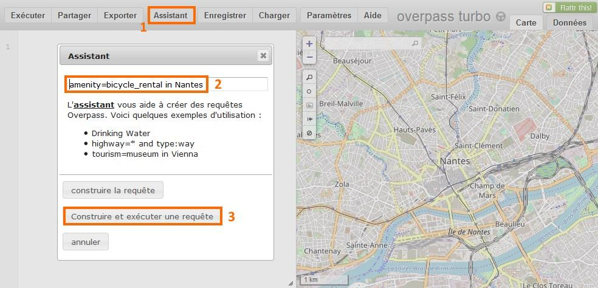
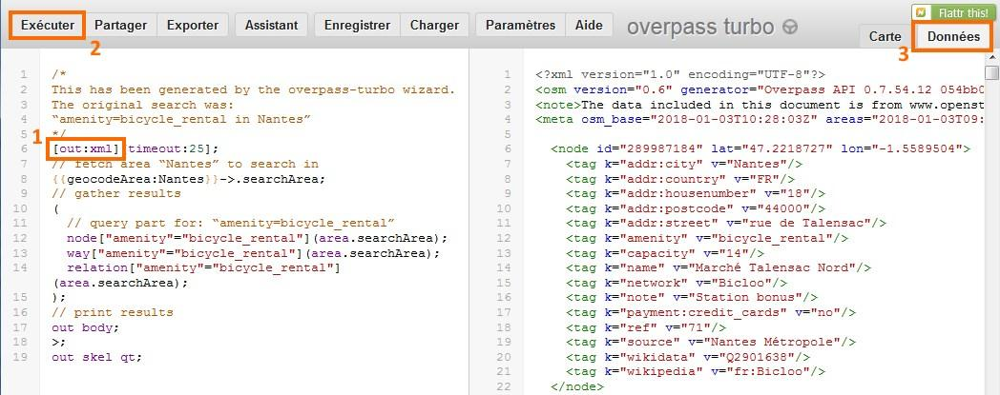
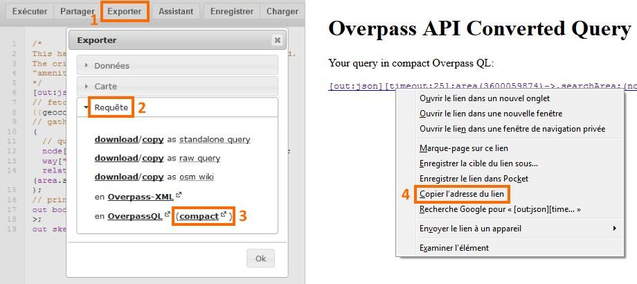
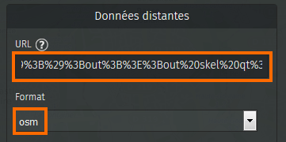
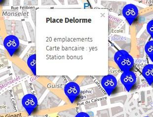
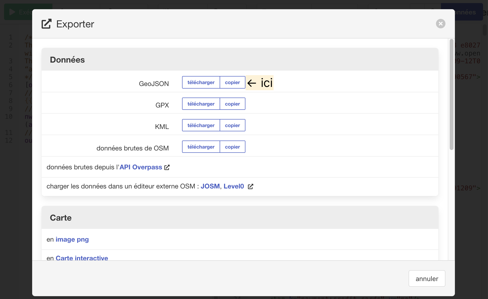
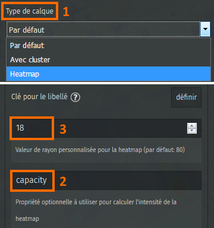
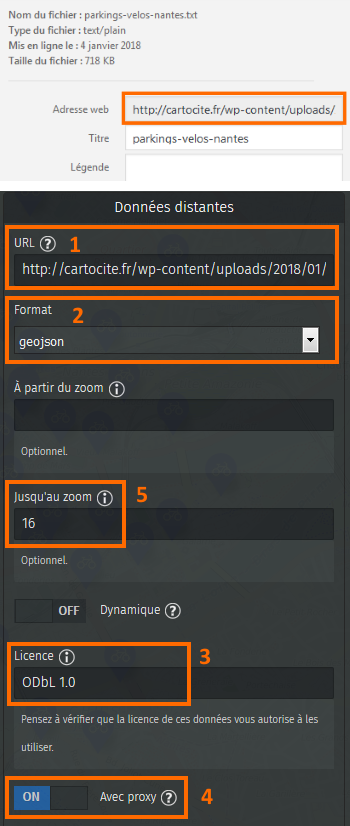
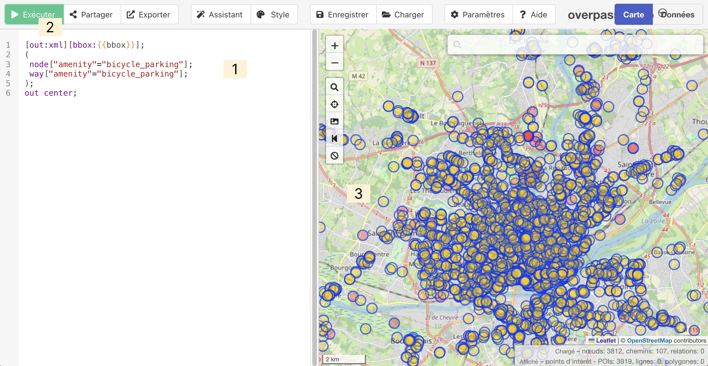

!!! abstract "Ce que nous allons apprendre"

    - Créer un calque utilisant des *données distantes* c’est-à-dire non
      stockées par uMap
    - Utiliser une **requête Overpass** comme source de données distantes
    - Utiliser une *requête dynamique* prenant en compte l’étendue visible
      de la carte
    - Contrôler l’affichage des calques en fonction du niveau de zoom

## Procédons par étapes

L’objectif de ce tutoriel est d’explorer les différentes manières
d’afficher sur une carte uMap des données externes, ou distantes,
c’est-à-dire des données qui ne sont pas stockées sur le serveur uMap.
Nous allons pour cela utiliser des données **OpenStreetMap**, que nous
allons extraire avec l’[API
Overpass](https://wiki.openstreetmap.org/wiki/FR:Overpass_API/Overpass_QL).

Nous allons en quelques étapes créer une carte du vélo à Nantes,
montrant les stationnements ainsi que les locations en libre-service.

### 1. Je crée un calque affichant le résultat d’une requête Overpass

Commençons par afficher les stations *Bicloo*, les locations de vélos en
libre-service à Nantes. Allons-y étape par étape :

1.  produire et tester la requête Overpass avec Overpass Turbo
2.  adapter la requête pour produire des données acceptées par uMap
3.  exporter la requête
4.  créer un calque uMap utilisant cette requête

#### Créer la requête Overpass

Le site [Overpass Turbo](http://overpass-turbo.eu/) propose un assistant
qui facilite la rédaction d’une requête. Activez l’assistant et
saisissez le texte suivant, qui permet d’extraire les locations de vélo
situées sur la commune de Nantes :

    amenity=bicycle_rental in Nantes

Cliquez sur **Construire et exécuter la requête** : la requête est créée
dans l’éditeur à gauche de la carte, puis le résultat est affiché sur la
carte.

#### Adapter la requête pour uMap

Avant d’exporter la requête nous devons l’adapter. L’assistant Overpass
Turbo produit des requêtes dont le résultat est au format JSON. uMap
sait lire des données dans plusieurs formats, dont le format GeoJSON,
mais pas le format JSON produit par Overpass. Par contre uMap comprend
très bien le format XML selon la syntaxe OSM (OpenStreetMap).

Pour que la requête produise des données au format XML/OSM, il suffit de
modifier dans l’éditeur de requête la clause **`[out:json]`** par
**`[out:xml]`**. Vous pouvez à nouveau exécuter la requête et observer
la différence de format dans l’onglet **Données** qui montre le résultat
de la requête.

#### Exporter la requête Overpass

Exportez la requête en cliquant sur **Exporter** : un panneau s’affiche.
Ouvrez l’onglet **Requête** et cliquez sur **compact** à droite de
**Overpass QL**. Un nouvel onglet intitulé **Overpass API Converted
Query** apparaît. Faites un **clic droit** sur la ligne soulignée en
bleu, et choisir **Copier l’adresse du lien** (avec Mozilla Firefox) :
l’URL de la requête est copié dans le presse-papier.

#### Utiliser la requête dans uMap

Dans un nouvelle carte uMap, créez un calque et ouvrez l’onglet
**Données distantes**. Collez dans la case URL le contenu du
presse-papier et sélectionez le format **osm**, qui correspond au format
XML dans Overpass.

Notez que l’URL est *encodée* pour pouvoir être utilisée comme requête
HTTP : les caractères spéciaux comme `"` sont convertis en `%22`. Ne les
modifiez pas !

Vous pouvez configurer le calque comme cela a été décrit dans les
tutoriels précédents.

De la même façon que les valeurs d’un tableur peuvent être affichées dans les
infobulles (voir [cette section](9-map-from-spreadsheet.md)
du tutoriel précédent), vous pouvez afficher dans les infobulles les
*tags* OpenStreetMap. Les tags disponibles sont visibles dans l’onglet
Données sur Overpass Turbo.

Par exemple le gabarit suivant permet d’afficher des infobulles comme
celle de droite.

    # {name}
    {capacity} emplacements
    Carte bancaire : {payment:credit_cards}
    {note}

### 2. J’affiche les parkings à vélo efficacement

Ajoutons à notre carte les parkings à vélo. La requête Overpass pour
obtenir les parkings à vélos de Nantes est semblable à celle utilisée
pour les locations, et peut être créée avec l’assistant :
`amenity=bicycle_parking in Nantes`.

L’exécution de cette requête prend près de 5 secondes. Ce délai est trop
long pour une carte *interactive*. Aussi plutôt que d’exécuter le
requête lors de l’affichage de la carte nous préférons extraire les
données et les importer dans uMap.

#### Importer des données statiques

Dans Overpass Turbo, cliquez sur **Exporter**, sélectionnez l’onglet
**Données** puis cliquez sur **Download/copy as GeoJSON**. Cette
opération convertit le résultat de la requête dans le format GeoJSON (un
format standard pour transférer des données géographiques sur internet)
et crée un fichier nommé `export.geojson` dans le dossier
`Téléchargements` de votre ordinateur.

Dans la carte uMap importez le fichier ainsi produit dans un nouveau
calque (voir [cette section](9-map-from-spreadsheet.md) du tutoriel précédent).
Les parkings à vélos sont affichés mais la carte
perd en fluidité et ne réagit pas immédiatement lorsqu’on zoome ou la
déplace. Cela est dû au nombre élevé de marqueurs affichés sur la carte
(plus de 1600).

#### Afficher une carte de densité

Une possibilité pour
contourner ce problème est d’afficher les marqueurs sous forme de
clusters, ou de carte de chaleur (heatmap), aussi appelée carte de
densité. Nous choisissons la seconde option qui permet de prendre en
compte le nombre de places de chaque parking, stocké dans le tag
`capacity`.

Ainsi la carte montrera non pas le nombre de parkings à vélos mais le
nombre de places de stationnement (dans OpenStreetMap un seul parking à
vélo peut représenter un grand nombre d’*appuis-vélos*).

Dans les propriétés du calque, sélectionnez le Type de calque
**Heatmap**.

Ensuite, dans l’onglet **Propriétés avancées** saisissez `capacity` dans
le champ **Propriété optionnelle à utiliser pour calculter l’intensité
de la heatmap**. Enfin vous pouvez ajuster l’intensité de la couleur en
modifiant la **Valeur de rayon pour la heatmap**.

La carte gagne en fluidité, mais l’utilisation d’une *heatmap* ne permet
pas d’identifier l’emplacement précis des parkings à vélos. L’étape
suivante propose une solution pour résoudre cette inconvénient.

### 3. J’affiche un calque en fonction du niveau de zoom

Lorsque les données d’un calque sont ***distantes*** (c’est-à-dire
**non** stockées sur le serveur uMap), il est possible de contrôler
l’affichage de ces données en fonction du niveau de zoom. Il faut pour
cela déposer le fichier de données sur un serveur et déterminer l’URL de
ce fichier.

#### Utiliser un fichier stocké sur un serveur

Si vous disposez d’un accès FTP à un serveur, cela ne pose pas de
difficulté. Si vous avez accès au *back office* d’un CMS comme
Wordpress, vous pouvez probablement y déposer un fichier. Prenons
l’exemple de Wordpress.

Par sécurité Wordpress ne permet pas de déposer un fichier au format
JSON. Il se fie pour cela à l’extension du nom de fichier, il est donc
possible de contourner cette contrainte en renommant le fichier.
Procédons par étapes.

1.  renommez le fichier `export.geojson` produit plus haut en
    `parkings-velos-nantes.txt`
2.  dans le *back office* Wordpress, ajoutez un **Média** et
    sélectionnez le fichier ainsi renommé
3.  affichez les détails du fichier et copiez son **Adresse Web**, de la
    forme
    `http://monsite.fr/wp-content/uploads/2018/01/parkings-velos-nantes.txt`
4.  créez un nouveau calque uMap et collez cette adresse Web dans le
    champ **URL** de l’onglet **Données distantes**
5.  sélectionnez le format **geojson**
6.  précisez la licence qui s’applique aux données : **ODbL 1.0**
    puisqu’il s’agit de données OpenStreetMap
7.  activez l’option **Avec proxy** en bas de cet onglet : cela autorise
    le navigateur Web à accéder à un fichier stocké sur un serveur autre
    que le serveur uMap
8.  enregistrez les modifications de la carte

#### Combiner deux calques utilisant le même fichier

Pour associer fluidité de la carte et affichage de chaque parking nous
allons associer deux calques utilisant les mêmes données :

-   jusqu’au niveau de zoom 16, un calque montrant la capacité de
    stationnement sous forme de *heatmap*
-   à partir du niveau de zoom 16, un calque montrant les parkings à
    vélo sous forme de marqueurs

À nouveau procédons par étapes.

1.  éditez le calque créé précedemment et dans l’onglet **Données
    distantes** saisissez la valeur **16** dans le champ **Jusqu’au
    zoom**
2.  dupliquez le calque avec l’action **Cloner** de l’onglet **Actions
    avancées** : ainsi le nouveau calque est déjà configuré pour
    utiliser le fichier placé sur le seveur
3.  sélectionnez le **Type de calque** par défaut pour le nouveau calque
4.  dans l’onglet **Données distantes** saisissez la valeur **16** dans
    le champ **À partir du zoom**

Enfin vous pouvez renommer le nouveau calque, configurer le type de
marqueur, et définir le gabarit de popup, par exemple :

    # {capacity} emplacements
    Type : {bicycle_parking}
    Couvert : {covered}

L’image à droite montre un extrait de la carte au niveau de zoom 16,
auquel nous avons choisi d’afficher les deux calques.

### 4. J’utilise une requête dynamique

Utiliser des données extraites plutôt qu’une requête présente un
inconvénient : la mise à jour des données sur OpenStreetMap n’est pas
répercutée sur notre carte. Pour pallier à cela nous vous proposons de
modifier le calque montrant les parkings à vélos sous forme de
marqueurs, de sorte qu’il utilise une requête dynamique.

Une **requête dynamique** permet d’*injecter* dans la requête des
*variables* relatives à l’état actuel de la carte uMap. Nous allons
utiliser une requête qui s’applique sur la seule partie visible de la
carte, définie par un rectangle (ou *bounding box*). Cette requête
s’exécutera à chaque zoom ou déplacement de la carte (d’où le terme
*dynamique*) et récupérera les parkings à vélos à l’intérieur de ce
rectangle.

#### Simplifier la requête Overpass

!!! note

    Pour faciliter l’opération nous commençons par
    simplifier la requête Overpass. Les points importants sont :

    1.  placer la clause **`[bbox:{{bbox}}]`** en entête de requête pour que
        ce paramètre ne soit présent qu’une seule fois
    2.  remplacer la production du résultat par la clause **`out center;`**
        qui permet de convertir chaque *way* (fermé ou pas) en un point

            [out:xml][bbox:{{bbox}}];
            (
             node["amenity"="bicycle_parking"];
             way["amenity"="bicycle_parking"];
            );
            out center;

#### Adapter et exporter la requête

L’opération est délicate, et exige sang froid et concentration :

1.  remplacez `{{box}}` par `{south},{west},{north},{east}` : il s’agit
    de 4 variables qu’uMap remplacera, lors de l’exécution de la
    requête, par les valeurs définissant l’emprise de la carte.
2.  exportez la requête en utilisant l’option **download/copy as
    standalone query** : un fichier texte est produit et téléchargé.
3.  ouvrez le fichier dans un éditeur de texte et ajoutez en début de
    ligne la base de l’URL permettant d’exécuter une requête Overpass :
    `http://overpass-api.de/api/interpreter?data=`
4.  copiez la requête modifiée et collez le texte dans le champ URL de
    l’onglet **Données distantes**
5.  activez l’option **Dynamique** et définissez le zoom à partir duquel
    le calque est affiché
6.  selon le serveur Overpass utilisé, l’option **Avec
    proxy** doit être activée ou désactivée (voir ci-dessous)

Par commodité la requête modifiée est reprise ci-dessous, où elle peut
être copiée par un triple-clic :

    http://overpass-api.de/api/interpreter?data=[out:xml][bbox:{south},{west},{north},{east}];(node["amenity"="bicycle_parking"];way["amenity"="bicycle_parking"];);out center;

!!! note
    N’hésitez pas à utiliser un autre serveur Overpass en
    libre service, dont la liste est disponible dans les **Paramètres
    généraux** de Overpass Turbo, par exemple
    `https://overpass.kumi.systems/`. Attention ce dernier exige
    d’**activer** l’option **Avec proxy**, alors que le serveur
    `http://overpass-api.de/` nécessite que l’option soit **désactivée**.

!!! note

    N’utilisez pas la variable {bbox} car elle sera
    remplacée par des coordonnées dont l’ordre (W,S,N,E) n’est pas celui
    attendu par Overpass (S,W,N,E) !

Vous pouvez manipuler ci-dessous la carte produite par l’ensemble de ce
tutoriel. Zoomez jusqu’à ce que les parkings à vélos apparaissent et
déplacez la carte pour constater l’aspect dynamique des requêtes.

<iframe width="100%" height="400px" frameBorder="0" src="https://umap.openstreetmap.fr/fr/map/le-velo-a-nantes_189194?scaleControl=false&miniMap=false&scrollWheelZoom=false&zoomControl=true&allowEdit=false&moreControl=false&searchControl=null&tilelayersControl=null&embedControl=null&datalayersControl=false&onLoadPanel=undefined&captionBar=false"></iframe>
<a href="http://umap.openstreetmap.fr/fr/map/le-velo-a-nantes_189194">Voir en plein écran</a>

## Faisons le point

Nous avons vu comment créer une carte montrant les données OpenStreetMap
à jour, à l’aide de requêtes Overpass. Seule la couche montrant la
densité des stationnements sous forme de *heatmap* nécessitera de
renouveler l’extraction des données de temps en temps.

!!! note
    Les serveurs Overpass utilisés dans ce tutoriel sont
    des serveurs en libre service mis à disposition gracieusement. Ces
    serveurs sont très sollicités aussi il convient de les utiliser avec
    modération.

    Si vous produisez une carte destinée à un grand nombre de consultations,
    préférez l’utilisation de données statiques, importées dans uMap ou
    stockées sur un serveur. Merci !

    Si vous utilisez Github, ce [court
    tutoriel](https://hackmd.io/OkwpRqQ7QXC3p8C0jfTUGQ?view) en anglais
    explique comment utiliser un *workflow* pour exécuter une requête
    Overpass et placer le résultat en cache.

??? info "Licence"

    Travail initié par Antoine Riche sur [Carto’Cité](https://wiki.cartocite.fr/doku.php?id=umap:11_-_je_valorise_les_donnees_openstreetmap_avec_umap) sous licence [CC-BY-SA 4](https://creativecommons.org/licenses/by-sa/4.0/deed.fr).
