!!! abstract "Ce que nous allons apprendre"

    - Créer un gabarit Grist compatible uMap
    - Géocoder des adresses (:fontawesome-solid-landmark-flag: pour les agents publics seulement)
    - Rendre un document Grist public
    - Lier le CSV de Grist avec un calque uMap

Un [un film tutoriel](https://tube.numerique.gouv.fr/w/kya6m1aFtgDcy2LMkgUBya?start=12s)
a été créé pour montrer le déroulé de ce tutoriel.

## 1. Créer un gabarit Grist compatible uMap

!!! osm-instance "Pour le grand public, les associations…"

    Rendez-vous sur le [site officiel de Grist](https://www.getgrist.com/) ou votre propre instance.

!!! french-instance "Pour les agents publics"

    Rendez-vous sur le site Grist agents publics via
    [La Suite Numérique](https://lasuite.numerique.gouv.fr/services/grist).

Créer un nouveau document vide :

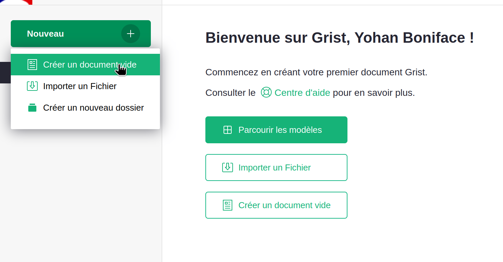

Ajouter les colonnes nécessaires, plus au moins ces trois colonnes : `Adresse`, `Latitude`, `Longitude`.

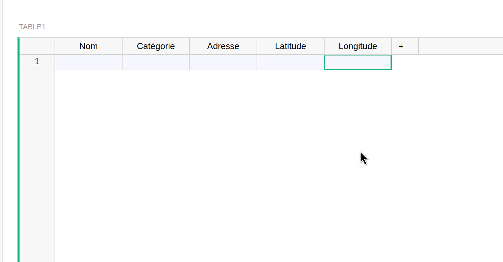

!!! warning

    Attention, il faut mettre les colonnes `Latitude` et `Longitude` en type `Texte` :

    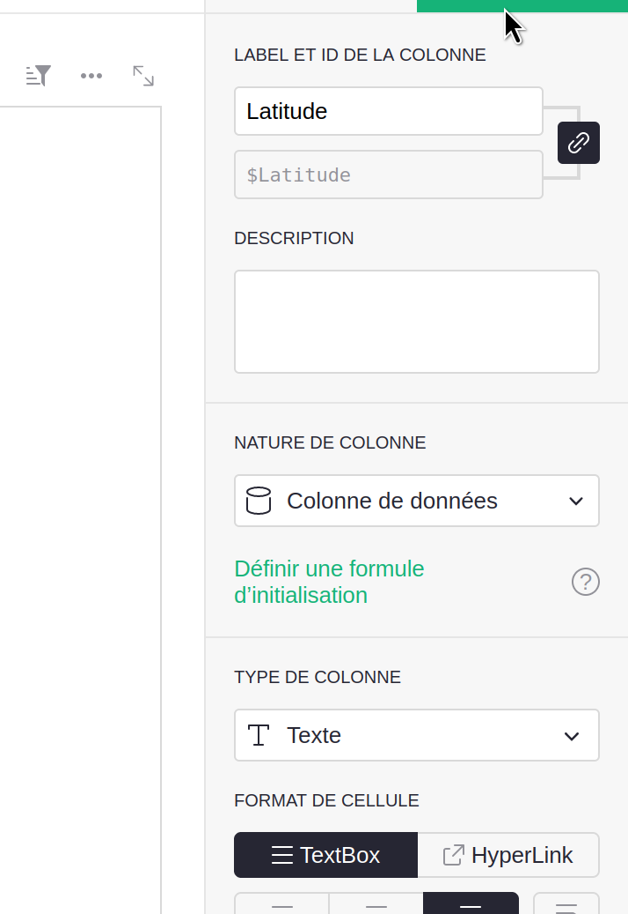

## 2. Géocoder des adresses (:fontawesome-solid-landmark-flag: pour les agents publics seulement)

!!! french-instance "Pour les agents publics"

    Cette conversion n’est accessible qu’aux agents publics, elle consiste
    à convertir automatiquement les adresses en coordonnées géographiques
    (latitude, longitude). Si vous avez déjà ces informations dans votre
    document, vous pouvez passer à l’étape 3 ci-dessous.

Il faut maintenant ajouter l’outil de géocodage développé par l’ANCT.
Pour ça, cliquer sur « Ajouter une vue à la page » :

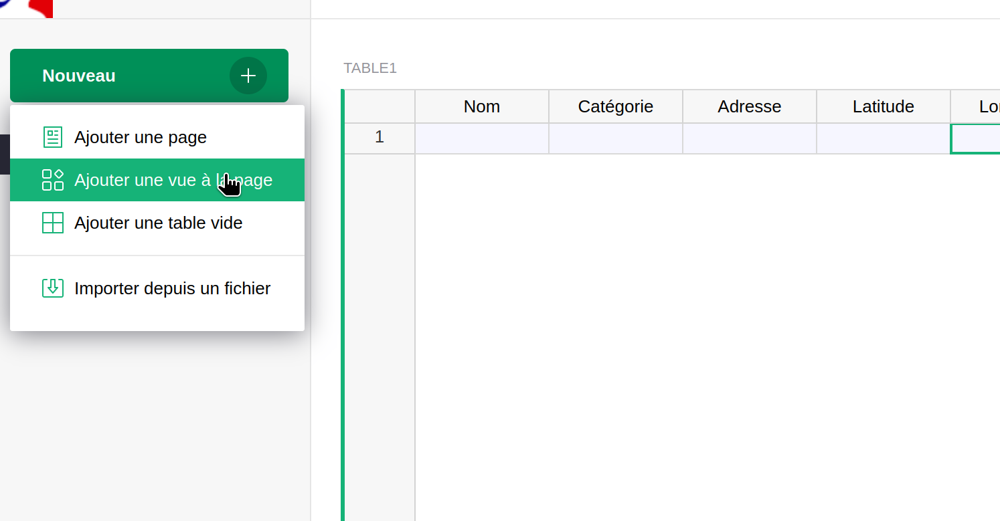

Puis choisir `Custom`, sélectionner le nom de la table dans la source des données
(ici « Table1 »), et aussi sélectionner la table dans `Select by` :

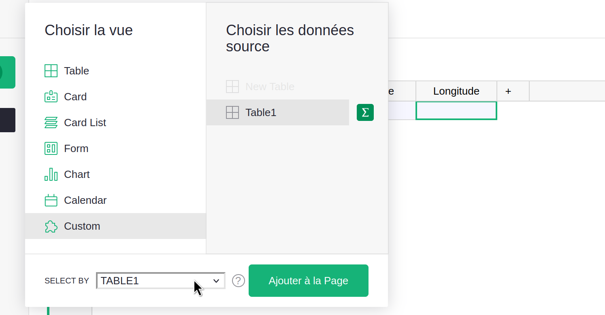

Dans la colonne de droite, si on est sur l’instance Grist de l’ANCT,
choisir « Geocodeur » dans la liste déroulante,
sinon choisir `Custom URL` et ajouter l’URL suivante:

<https://betagouv.github.io/grist-custom-widgets-fr-admin/geocode>

Dans le panneau de droite, sélectionner les colonnes permettant de connecter
l’outil à notre tableau :

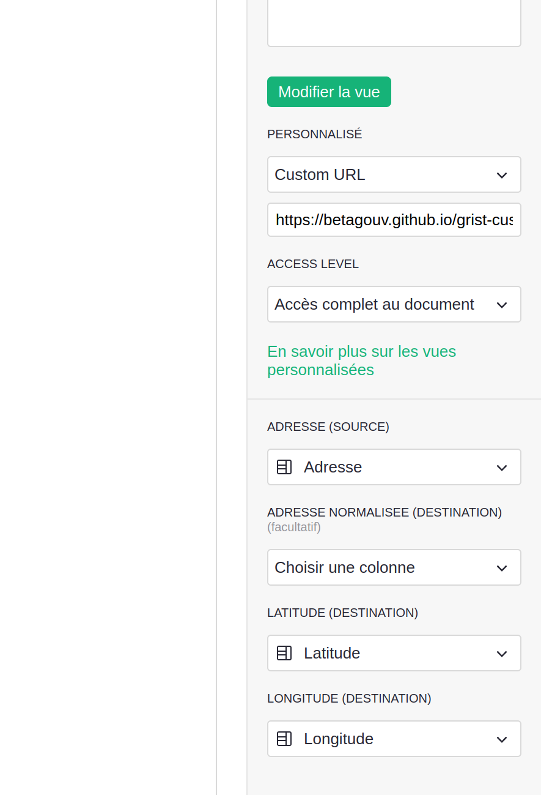

La colonne `Adresse` comme source, puis bien référence les colonnes `Latitude` et `Longitude`.

On peut optionnellement ajouter une colonne `Adresse normalisée` (dans le tableur)
et la référencer ici, dans ce cas le géocodeur affichera l’adresse qu’il a trouvé.
Ça permet un contrôle de plus.

Renseigner ensuite une ou plusieurs lignes de données,
en essayant d’avoir une adresse aussi précise que possible :

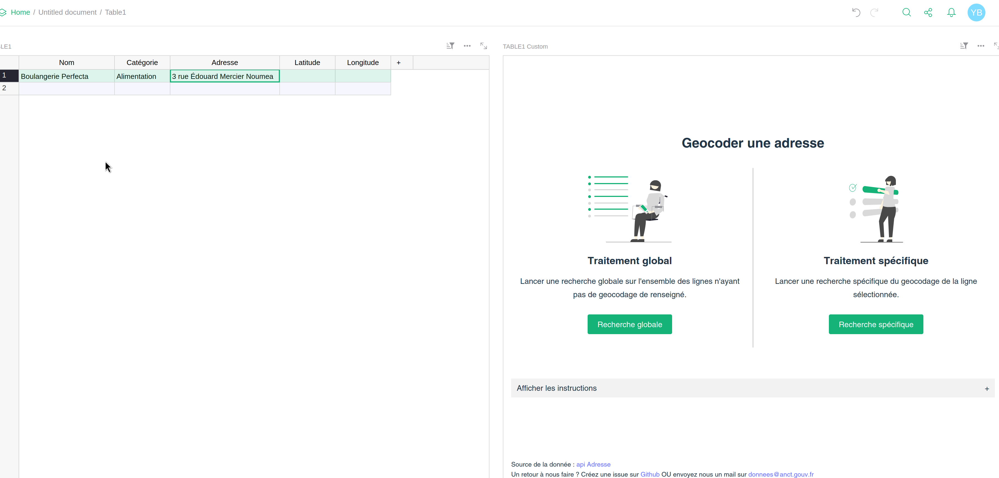

Puis cliquer sur « Traitement spécifique » pour ne traiter
que la ligne sélectionnée, ou bien sur « Traitement global »
pour traiter toutes les lignes du document.

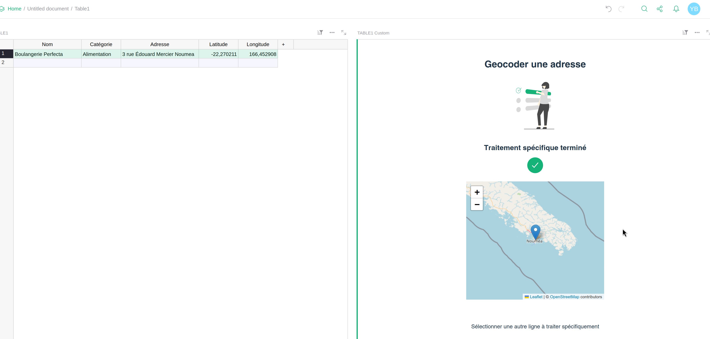

## 3. Rendre un document Grist public

Il faut ensuite rendre le document Grist public pour pouvoir ensuite le référencer côté uMap.

Pour ça, aller dans « Gérer les utilisateurs » :

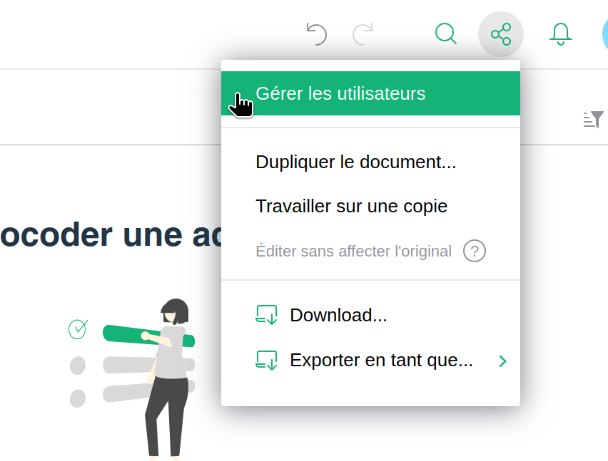

Puis activer l’accès public :

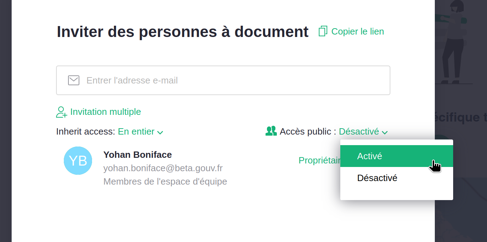

## 4. Lier le CSV de Grist avec un calque uMap

Pour copier l’URL qu’on va indiquer côté uMap, c’est ici
(clic droit « enregistrer le lien ») :

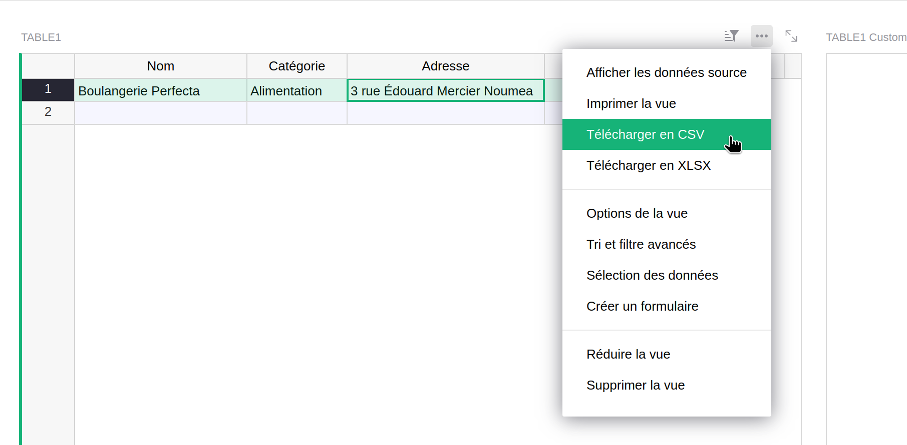

Le lien devrait ressembler à quelque chose comme ça :

https://grist.incubateur.net/o/docs/api/docs/4McELEs6kBpQAkmzupHy9F/download/csv?viewSection=1&tableId=Table1&activeSortSpec=%5B%5D&filters=%5B%5D&linkingFilter=%7B%22filters%22%3A%7B%7D%2C%22operations%22%3A%7B%7D%7D

Maintenant, créer une carte sur uMap et ajouter un calque :

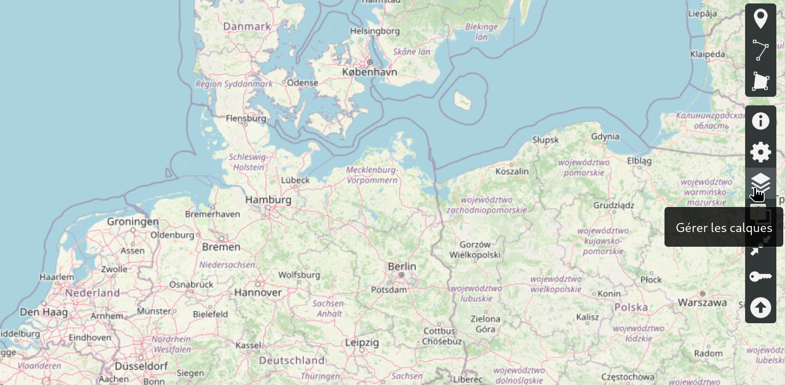

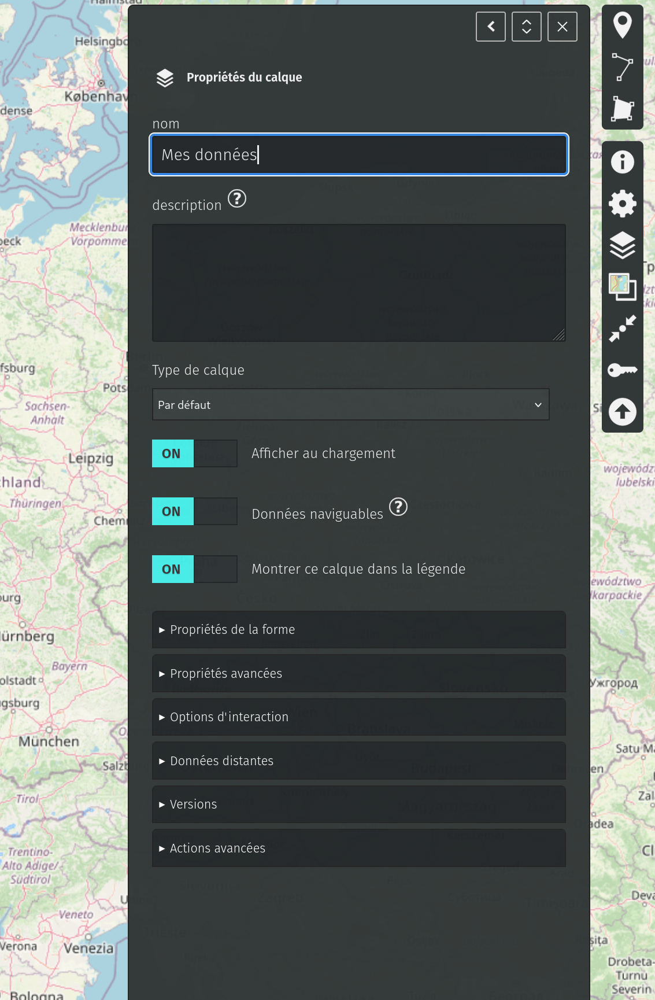

Dans « Données distantes », ajouter l’URL de Grist et choisir le format `CSV` :

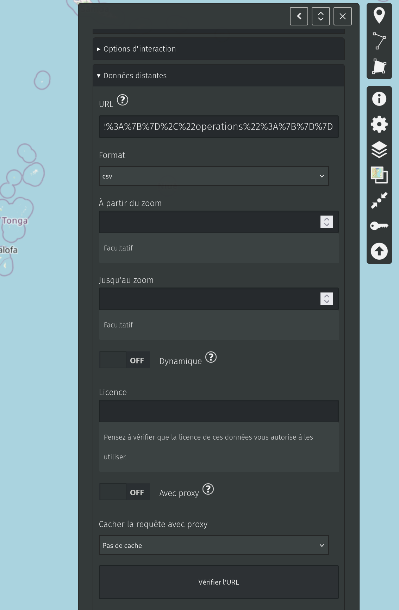

Pour une meilleure expérience utilisateurs, vous pouvez choisir
l’option `Proxy` avec un cache de la bonne durée selon la fréquence
de mise à jour des données dans Grist :

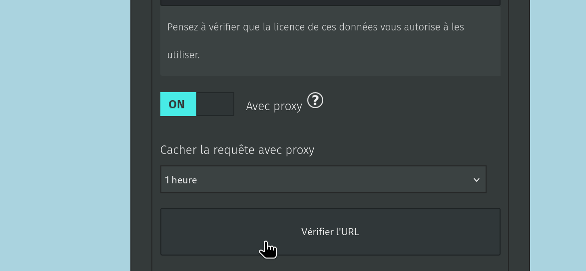

Pour améliorer l'intégration des données, allez dans les paramètres avancés
de la carte, puis dans les propriétés par défaut et :

- ajouter `Nom` comme clé pour le libellé, le filtre et la recherche
- ajouter `Catégorie` pour générer des filtres automatiques

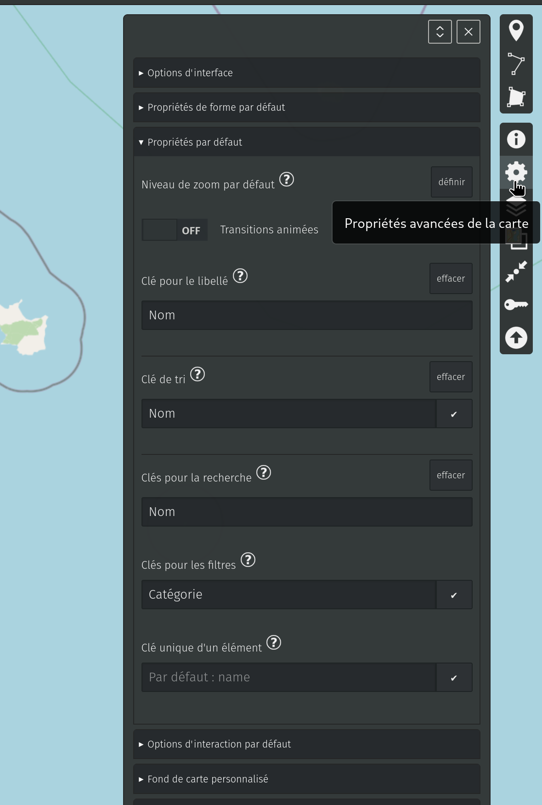

Et voilà !

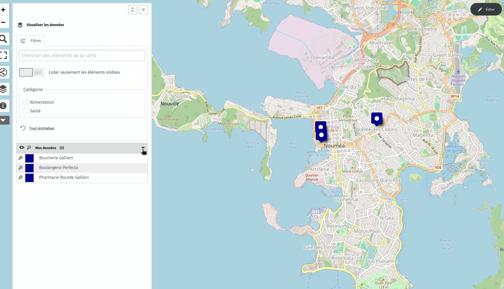

