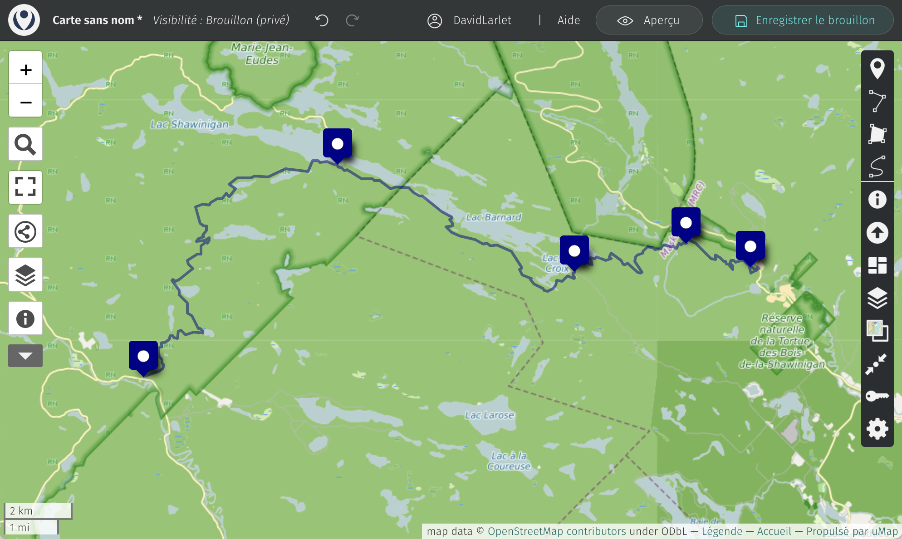
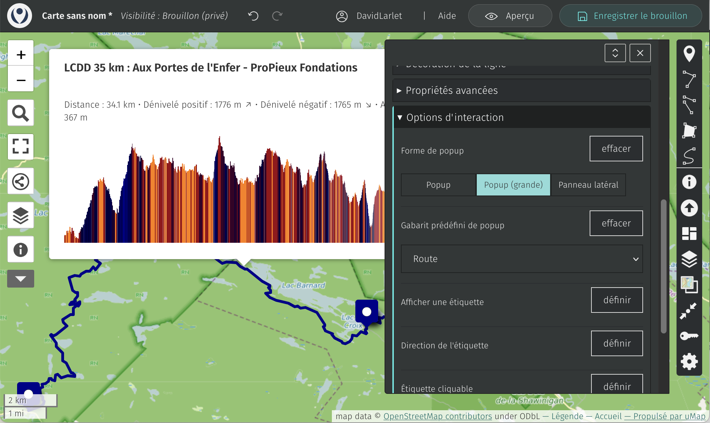
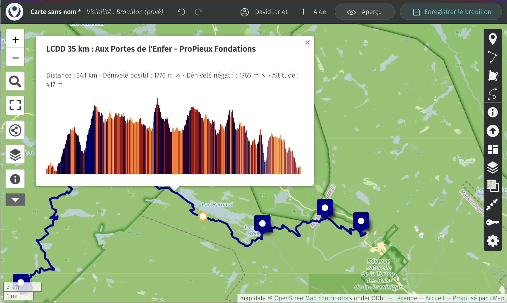

!!! abstract "Ce que nous allons apprendre"

    - Créer une carte à partir d’un fichier GPX
    - Lui ajouter une courbe d’altitude en popup

## 1. Créer une carte à partir d’un fichier GPX

Il suffit de glisser/déposer un fichier GPX sur la carte pour qu’un calque soit automagiquement créé à partir de ces données.

Une ligne devrait alors apparaître sur la carte et potentiellement des points pré-définis selon le fichier source :

## 2. Ajouter une courbe d’altitude

Faire un clic-droit **sur la ligne** et choisir le crayon d’édition.

Ouvrir les `Options d’interaction` et passer la `Forme de popup` à `Grande` pour avoir la place d’afficher le graphique.
Changer ensuite le `Gabarit prédéfini de popup` de `Par défaut` à `Route`.

Vous devriez voir la popup en arrière plan s’enrichir d’un graphique d’altitude :

Vous remarquerez qu’en balayant le graphique, la position en cours est rendue visible sur la carte (point orange sur la ligne) et son altitude est mise à jour dynamiquement dans la popup :

*Bonne promenade !*
