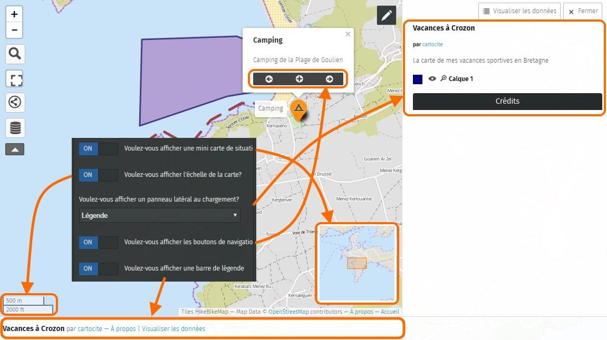

!!! abstract "Ce que nous allons apprendre"

    - Gérer son catalogue de cartes
    - Choisir un fond de carte
    - Sélectionner les options d’interface

## Procédons par étapes

### 1. Retrouver une carte

Vous souhaitez modifier une carte pour l’améliorer ou la mettre à jour.
Si vous avez redémarré votre navigateur et à fortiori votre ordinateur,
la première chose à faire est de retrouver la carte ! Si vous avez créé
cette carte avec votre compte, comme nous l’avons vu dans le tutoriel
[Créer un compte](3-create-account.md), afficher
une de vos cartes se fait en trois opérations simples :

1.  connectez-vous à votre compte umap
2.  affichez votre catalogue de cartes
3.  cliquez sur le nom de la carte

<figure>
    
    <figcaption>Bouton d’édition de la carte.</figcaption>
</figure>

La carte s’affiche alors en mode consultation.
Cliquez sur le bouton avec le crayon en haut à droite de la carte pour
passer en mode édition : vous pouvez dès lors modifier la carte.
N’oubliez pas de sauvegarder la carte une fois les modifications
terminées.

!!! note

    Il peut être fastidieux de passer du mode édition au
    mode consultation et vice-versa de façon répétée. Une astuce consiste à
    utiliser pour la même carte deux onglets ou deux navigateurs, l’un en
    mode édition l’autre en mode consultation. Vous devez tout de même
    **enregistrer** la carte dans l’onglet en mode édition avant de
    l’**actualiser** (par exemple avec la touche F5) dans l’onglet en mode
    consultation.

Vous pouvez retourner à votre catalogue de cartes à tout moment en
cliquant sur **Accueil** tout en bas à droite de la carte.

### 2. Changer le fond de carte

Nous avons vu dans le tutoriel [Naviguer dans une carte](1-browsing-a-map.md)
que plusieurs fonds de carte sont disponibles dans uMap.
Lorsque vous éditez une carte vous pouvez
choisir le fond de carte qui sera utilisé à l’affichage de la carte.

<shot-scraper
    data-output="static/tutoriels/map-tilelayers.png"
    data-url="https://umap.openstreetmap.fr/fr/map/new/"
    data-alt="Bouton de choix de fond de carte."
    data-width="46"
    data-height="47"
    data-selector=".leaflet-toolbar-icon.update-map-tilelayers"
    data-padding="5"
    >Bouton de choix de fond de carte.</shot-scraper>

Cliquez sur le pictogramme `Changer le fond de carte` : un panneau à droite montre
une vingtaine de fonds de cartes. Il vous suffit de cliquer sur l’un
d’eux : faites votre choix et n’oubliez pas d’enregistrer la
modification.

Le choix du fond de carte est une affaire de goût. Le contexte de la
carte peut vous aider à en choisir un plutôt qu’un autre, par exemple :

-   les fonds **Outdoors**, **Landscape** ou **OpenTopoMap** montrent le
    relief : judicieux pour une carte de randonnée
-   **OpenCycleMap** montre les grands itinéraires cyclistes, comme les
    EuroVélo (Côte Atlantique, Loire à Vélo…)
-   **Positron**, **Toner** et **OSM-Monochrome** sont en noir et blanc
    : vos marqueurs, lignes et polygones seront plus visibles
-   le style **HOTOSM**, créé par le [groupe
    humanitaire](http://wiki.openstreetmap.org/wiki/FR:Humanitarian_OSM_Team)
    d’OpenStreetMap, permet d’aller jusqu’à un niveau de zoom élevé
    (niveau 20) : intéressant si l’étendue de votre carte couvre un
    quartier ou votre jardin

!!! note

    Tous les fonds de carte utilisés par uMap, à
    l’exception des images aériennes de l’IGN, sont réalisés à partir des
    données OpenStreetMap. Ils sont produits par des associations, des
    entreprises ou des bénévoles qui les mettent gracieusement à
    disposition.

    Remarquez le texte affiché en bas à droite de la carte : il crédite les
    auteurs du fond de carte, par exemple
    `Map tiles by Stamen Design - Map Data © OpenStreetMap contributors`.

### 3. Choisir les options d’interface

Vous pouvez configurer les éléments de la carte mis à disposition des
utilisateurs qui consulteront votre carte. Vous pouvez par exemple
ajouter une mini-carte de situation ou une barre de légende, ou encore
décider quels boutons seront affichés.

<shot-scraper
    data-output="static/tutoriels/map-settings.png"
    data-url="https://umap.openstreetmap.fr/fr/map/new/"
    data-alt="Bouton des options de la carte."
    data-width="46"
    data-height="47"
    data-selector=".leaflet-toolbar-icon.update-map-settings"
    data-padding="5"
    >Bouton des options de la carte.</shot-scraper>

Pour cela, ouvrez dans
le menu **Propriétés avancées de la carte** l’onglet **Options d’interfaces**.
Vous pouvez activer ou désactiver une dizaine d’options dont voici la
signification.

Apparaît alors un long tableau de bord qui vous permet, pour chacun des
boutons sur la gauche de la carte, de contrôler leur visibilité :

-   **toujours** indique que le bouton est toujours visible pour
    l’utilisateur
-   **jamais** signifie que le bouton ne sera pas disponible
-   **caché** signifie que le bouton n’est accessible qu’après un clic
    sur le bouton « Plus ».
    Les boutons cachés ne seront bien sûr accessibles que si l’option
    `Voulez-vous afficher le bouton « Plus » ?`
    (plus bas sur le tableau de bord) est activée.

<shot-scraper
    data-output="static/tutoriels/control-more.png"
    data-url="https://umap.openstreetmap.fr/en/map/new/"
    data-alt="Icône pour afficher plus d’options."
    data-width="46"
    data-height="33"
    data-selector=".umap-control-more"
    data-padding="5"
    >Exemple de bouton « Plus ».</shot-scraper>

La partie basse du tableau de bord ne concerne pas ces boutons mais
d’autres éléments venant *habiller* la carte :

Quelques remarques :

-   si vous cachez les boutons de zoom **et** désactivez le zoom avec la
    molette de la souris, les utilisateurs ne pourront ni zoomer ni
    dézoomer … sauf à découvrir le menu accessible avec un clic droit
    sur la carte.
-   les boutons de navigation en bas des popups permettent de faire
    défiler les éléments de la carte

### 4. Copier ou supprimer une carte

Tout en bas des **Propriétés de la cartes**, l’onglet **Options
avancées** propose deux opérations peu utilisées mais qu’il est bon de
connaître :

-   **Supprimer** supprime la carte du serveur umap, ainsi que les
    données qui y sont associées !
-   **Cloner cette carte** effectue une copie de la carte et de ses
    données. La nouvelle carte est ajoutée à votre catalogue.

Dans les deux cas un message vous demande de confirmer l’opération.

## Faisons le point

Vous savez créer, modifier et personnaliser une carte.
Vous savez styliser vos marqueurs, lignes et polygones.
Enfin vous savez gérer votre catalogue de cartes.
Vous allez découvrir comment importer des données en « un clic »
issues de l’open data et gagner du temps par rapport au dessin de toutes les formes.

Une fois ces opérations maîtrisées, les tutoriels de niveau
intermédiaire vous apprendront à structurer vos cartes avec des calques
et enrichir le contenu de vos popups. Vous découvrirez également comment
publier une carte sur un site Web, et définir qui peut la voir et la
modifier.

??? info "Licence"

    Travail initié par Antoine Riche sur [Carto’Cité](https://wiki.cartocite.fr/doku.php?id=umap:4_-_je_modifie_et_personnalise_ma_carte) sous licence [CC-BY-SA 4](https://creativecommons.org/licenses/by-sa/4.0/deed.fr).

