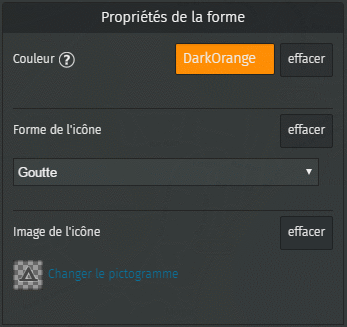
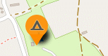
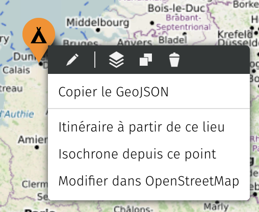
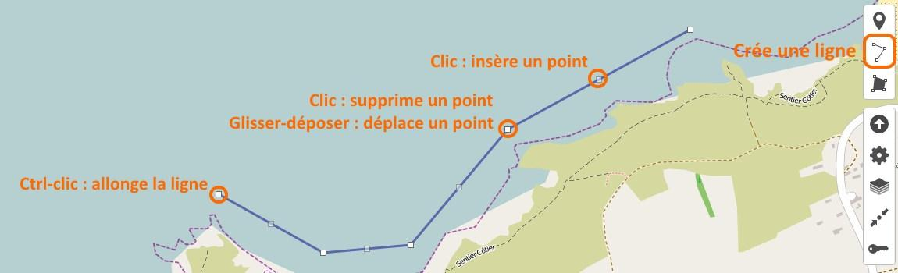
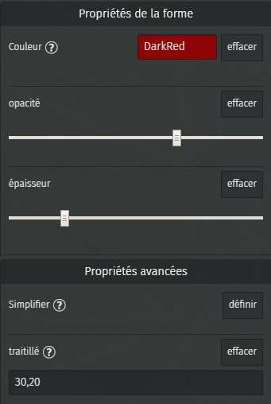
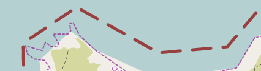
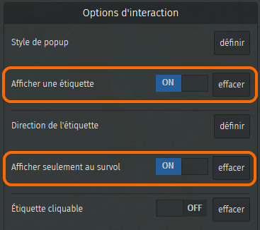

!!! abstract "Ce que nous allons apprendre"

    - Changer la forme, la couleur et le pictogramme d’un marqueur
    - Créer et modifier une ligne
    - Contrôler l’affichage des étiquettes

Voici comment réaliser une carte contenant de jolis marqueurs et des lignes
avec pour exemple la carte de nos vacances au
[Camping de la plage Goulien](https://www.openstreetmap.org/way/119055693)
sur la Presqu’île de Crozon en Bretagne.

### 1. Créer un joli marqueur

Commençons par créer une carte : donnons-lui un nom, définissons une
emprise et ajoutons un marqueur à [l’emplacement du
camping](http://www.openstreetmap.org/?mlat=48.2387&mlon=-4.5434#map=16/48.2387/-4.5434).
Nous avons vu dans [le tutoriel précédent](2-first-map.md) comment effectuer ces opérations.

Ce gros marqueur bleu n’est pas très explicite pour figurer un camping.
Remédions à cela. Dans le panneau latéral visible lorsqu’un marqueur est
sélectionné, le menu **Propriétés de la forme** permet de modifier
l’apparence du marqueur :

-   **Couleur** : cliquer sur `définir` permet de choisir une couleur.
    Notez que vous pouvez définir une couleur par [son nom
    CSS](http://www.w3schools.com/cssref/css_colors.asp) ou par son code
    héxadécimal, que vous pouvez choisir par exemple avec ce [sélecteur
    de couleurs](http://htmlcolorcodes.com/fr/selecteur-de-couleur/).
-   **Forme de l’icône** : le choix `Par défaut` correspond au marqueur
    actuel, les autres choix sont Cercle, Goutte et Épingle.
-   **Image de l’icône** : cliquer sur `définir` pour choisir parmi une
    centaine de pictogrammes. Notez que le picto n’est affiché que pour
    les formes d’icônes `Par défaut` et `Goutte`.

Voici le marqueur obtenu avec les propriétés ci-contre :

#### Modifier un marqueur

Pour modifier un marqueur de la carte, plusieurs possibilités s’offrent à vous :

-   un clic sur le marqueur vous permet soit d’afficher le panneau
    d’édition (stylo), soit de supprimer le marqueur (corbeille)
-   **shift-clic** est un raccourci qui affiche directement le panneau
    d’édition
-   un glisser-déposer vous permet de déplacer le marqueur sur la carte

### 2. Créer une ligne

Le premier jour de vacances nous allons en kayak de mer jusqu’à la
Pointe de Dinan à l’ouest de la plage de Goulien. Traçons l’itinéraire
suivi.

<shot-scraper
    data-output="static/tutoriels/draw-polyline.png"
    data-url="https://umap.openstreetmap.fr/fr/map/new/"
    data-alt="Bouton de dessin d’une ligne."
    data-width="46"
    data-height="47"
    data-selector=".leaflet-toolbar-icon.umap-draw-polyline"
    data-padding="5"
    >Bouton de dessin d’une ligne.</shot-scraper>

Le bouton **Dessiner une ligne** permet de tracer, point par point,
une ligne constiutée de plusieurs segments.
Cliquez à nouveau sur le dernier point tracé pour
terminer la ligne : apparaît alors à droite un panneau permettant de
donner un nom et une description à la ligne, comme pour les marqueurs.

#### Modifier une ligne

A tout moment vous pouvez sélectionner une ligne en double-cliquant
dessus. Vous pouvez alors éditer ses propriétés dans le panneau latéral,
ou modifier son tracé sur la carte :

-   **supprimer un point** de la ligne, matérialisé par un carré blanc,
    en cliquant dessus
-   **déplacer un point** par un glisser-déposer
-   **insérer un point** en cliquant sur un carré gris se trouvant au
    milieu de chaque segment
-   **allonger la ligne** avec un Ctrl-Clic lorsque le curseur est placé
    sur le premier ou dernier point
-   **couper la ligne** en deux : Clic droit sur un point puis choisir
    l’option `Scinder la ligne`

#### Propriétés d’une ligne

Les propriétés d’une
ligne permettent de définir sa couleur et d’autres paramètres
définissant son *style* :

-   l’**opacité** va de transparent à gauche à totalement opaque à
    droite. Plus le trait est épais plus il peut être transparent.
-   l’**épaisseur** est définie en pixels, sa valeur par défaut est 3 :
    glisser le curseur vers la droite pour un trait plus épais (qui sera
    plus facile à sélectionner).

Les **propriétés avancées** permettent de :

-   **simplifier** le tracé permet de réduire le nombre de points pour
    l’adapter au niveau de zoom. Il est en général inutile de simplifier
    un tracé réalisé *à la main*.
-   définir un **traitillé**, par une série de chiffres séparés par des
    virgules : longueur (en pixels) visible, longueur invisible,
    longueur visible, etc. L’épaisseur du trait doit être prise en
    compte : plus les traits sont épais plus les intervalles doivent
    être grands.

Voici le style de trait obtenu avec les propriétés ci-contre :

### 3. Ajouter des étiquettes

Pour aider l’identification des
différents éléments de notre carte, nous pouvons leur associer une
étiquette. L’onglet **Options d’interaction** permet de contrôler
l’affichage d’une étiquette associée à chaque élément :

-   **Afficher une étiquette** active son affichage, elle est alors
    placée automatiquement
-   **Direction de l’étiquette** vous permet de fixer la position, à
    droite ou à gauche de l’élément, ou encore au-dessus ou en-dessous
-   **Afficher seulement au survol** de la souris est une option
    intéressante si la carte est dense : afficher toutes les étiquettes
    surchagerait la carte
-   **Étiquette cliquable** permet d’afficher l’infobulle correspondante
    si l’utilisateur clique sur l’étiquette, et non seulement en cas de
    clic sur la *géométrie* de l’élément.

## Faisons le point

Notre deuxième carte est déjà plus intéressante que la première, et nous
savons la retrouver facilement. Nous avons vu comment créer, *styliser*
et modifier points et lignes. Nous n’avons pas traité ici des polygones,
qui représentent des surfaces. Certaines fonctionnalités propres aux
polygones méritent d’être détaillées, ce que nous ferons dans le
tutoriel [Le cas des polygones](8-polygons.md).

Pour le moment voyons comment nous pouvons davantage
[personnaliser notre carte](4-customize-map.md).

??? info "Licence"

    Travail initié par Antoine Riche sur [Carto’Cité](https://wiki.cartocite.fr/doku.php?id=umap:3_-_j_utilise_un_compte_et_cree_une_belle_carte) sous licence [CC-BY-SA 4](https://creativecommons.org/licenses/by-sa/4.0/deed.fr).

