!!! abstract "Ce que nous allons apprendre"

    - consulter des sources de données
    - découvrir des exemples de cartes
    - cloner une carte uMap
    - cas pratique : utiliser un jeu de données placé sur data.gouv.fr

## L’open data (données ouvertes)

Outre les données produites par ma communauté OpenStreetMap, accessibles sur [GeoDataMine](https://geodatamine.fr/) et dans [l’assistant d’import de données de uMap](6-one-click-data-import.md), les ressources d’open data sont nombreuses et variées. En effet, les collectivités de plus de 3 500 habitants et les services publics doivent placer leurs données en open data conformément à la [Loi pour une République numérique](https://www.vie-publique.fr/eclairage/20301-loi-republique-numerique-7-octobre-2016-loi-lemaire-quels-changements). Le service public de la donnée organise leur publication sur [data.gouv.fr](https://www.data.gouv.fr/fr/) qui est un portail généraliste.

Il existe également des bases plus adaptées à des jeux de données, par exemple les archives, des données géographiques, socio-économiques… Les collectivités mettent parfois aussi directement leurs données à disposition sur leurs portails open data. Des éditeurs de solutions proposent également des bases de données.

## 1. Formats de données utilisés par uMap

### geojson

Ce format est utilisé pour des données de type point, ligne, chaîne de caractères, polygone.

Toutes les propriétés sont importées dans uMap.

❓ Usage très large dans uMap.

### gpx

Ce format ouvert permet l’échange de coordonnées géographiques issues de GPS, points de cheminement (*waypoints*), traces (*tracks*) ou itinéraires (*routes*).

Propriétés importées dans uMap : `name`, `desc`. (format pour des itinéraires)

❓ Les fichiers gpx peuvent provenir d’enregistrements personnels, par exemple de traces recueillies randonnées.

### kml

Format propriétaire qui contient des coordonnées géographiques, balisage, styles pour représenter des points, des lignes et des polygones.

Propriétés importées dans uMap : `name`, `description`.

### csv

C’est un format texte ouvert représentant des données tabulaires sous forme de valeurs séparées par des virgules. Pour utiliser un fichier Excel, il faut d’abord le convertir en `.csv`.

Propriétés importées dans uMap : virgule, tabulation ou point virgule pour séparer des valeurs. La projection SRS WGS84 est implicite. Seuls les points géométriques sont importés. L’importation se référera au titre dans les entêtes de colonnes de `lat` et `lon` au début de l’entête, et est insensible à la casse (peu importe les majuscules ou minuscules). Toutes les autres colonnes sont importées en tant que propriétés.

❓ Usage très large dans uMap, aussi bien pour des données en *open data* que pour ses propres données.

### umap

C’est le format d’enregistrement d’une carte, très utilisé par exemple pour cloner une carte sur l’instance OSM et l’importer sur l’instance uMap pour les agents publics. uMap importe toutes les données de la carte, y compris les calques et les propriétés. Il s’agit d’un bon moyen de sauvegarder sa carte uMap.

❓ Voir plus loin, comment cloner une carte uMap.

Ainsi qu’osm et georss.

## 2. S’orienter sur data.gouv.fr

La plateforme [data.gouv.fr](https://www.data.gouv.fr/fr/) propose des données harmonisées, précise la date de mise à jour et permet de contacter l’administrateur qui a déposé le jeu de données. Il suffit d’utiliser l’outil de recherche pour préciser sa demande puis sélectionner le résultat voulu.
La principale difficulté : savoir quel jeu de données répondrait au besoin. Dans ce cas, il est conseillé de regarder aussi les « thématiques » et les « réutilisations » en bas de page d’accueil.

## 3. Gallica ! les archives de la Bibliothèque Nationale de France

La [base Gallica](https://gallica.bnf.fr/accueil/fr/content/accueil-fr?mode=desktop) est particulièrement utile pour afficher dans uMap des images, des cartes postales, des fonds de cartes anciennes. Il n’est pas obligatoire de télécharger l’illustration, certaines cartes se contentent de placer le lien pour qu’elle s’affiche :

### Vues de villes aux XVIe et XVIIe siècles

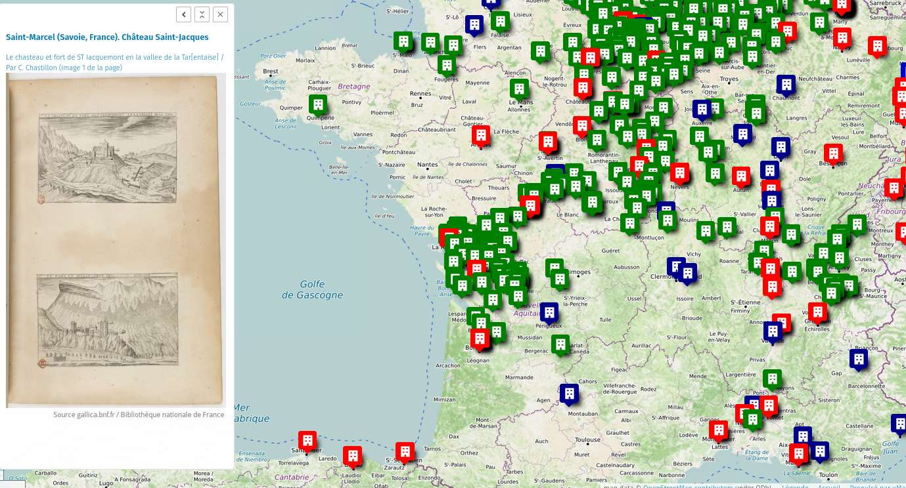

[Lien vers la carte en ligne](https://umap.openstreetmap.fr/fr/map/vues-de-villes-aux-xvie-et-xviie-siecles_635544#7/46.241/-1.329){ .md-button }

Deux exemples utilisant un plan ancien comme fond, en plus des images anciennes qui s’affichent en cliquant sur un pointeur :

### Photographies de Marseille 1862 à 1866 par A. Terris

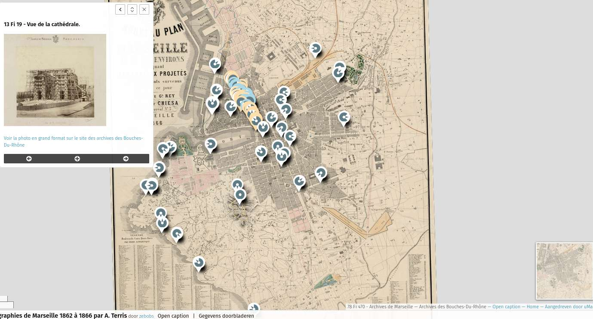

[Lien vers la carte en ligne](https://umap.openstreetmap.fr/nl/map/photographies-de-marseille-1862-a-1866-par-a-terri_277962#14/43.2909/5.3815){ .md-button }

### Metz 1872

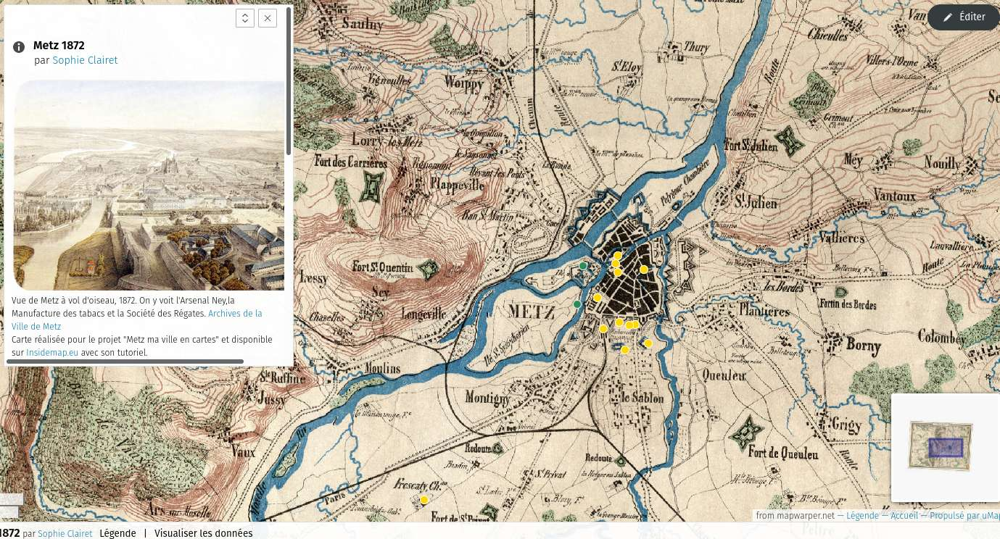

[Lien vers la carte en ligne](https://umap.incubateur.anct.gouv.fr/fr/map/metz-1872_50#13/49.1201/6.1419){ .md-button }

Dans ces deux derniers cas, le fond de carte doit être « redressé » avant d’être utilisé dans uMap comme [fond personnalisé](https://forum.openstreetmap.fr/t/integrer-un-fonds-de-carte-personnalise-sur-umap/19606).

## 4. Bases de données statistiques

uMap permet de représenter des données quantitatives par le biais de [cercles proportionnels](8-proportional-circles.md) ou de [cartes choroplèthes](10-embed-remote-data.md#produire-une-carte-de-chaleur-ou-heatmap) c’est à dire des plages de couleurs.

L’[INSEE](https://www.insee.fr/fr/accueil) et [Eurostat](https://ec.europa.eu/eurostat/fr/data/database) permettent de télécharger des fichiers statistiques généralistes.

Une fois un fichier enregistré, il faut vérifier le format des données et le modifier au besoin. Attention par exemple aux cellules fusionnées et aux espaces entre les séries de zéro.

## 5. Cloner une carte uMap

Pour utiliser les données d’une carte sur un autre fond, en faire plusieurs versions, il suffit de cloner la carte.

Exemple de besoin : présenter sur un site Internet la même carte plusieurs fois, en diversifiant le centrage et les fonds de cartes. La même carte initiale fournit plusieurs vues provenant de clones.

!!! french-instance "Pour les agents publics"

    Cette fonctionnalité permet également d’importer sur [l’instance uMap agents publics](https://umap.incubateur.anct.gouv.fr/fr/) une carte réalisée sur une autre instance.

    Voici les actions :

    - sauvegardez la carte que vous souhaitez cloner
    - créez une nouvelle carte - pour cloner la carte sur une nouvelle instance : connectez-vous à la nouvelle instance puis créez cette nouvelle carte et
    - importez la carte.

    Les deux cartes co-existent, une modification sur une carte n’impacte pas l’autre carte. Si la carte est partagée sur un site Internet, il faut veiller à **mettre à jour le lien** en cas de changement d’instance.

### 1. Sauvegarder la carte

Cliquez à gauche sur « Partager et télécharger »

<shot-scraper
    data-output="static/tutoriels/control-embed.png"
    data-url="https://umap.openstreetmap.fr/en/map/new/"
    data-alt="Icône du partage et de l’intégration."
    data-selector=".leaflet-control-embed"
    data-width="48"
    data-height="48"
    data-padding="5"
    >Permet de partager la carte ou d’en exporter les données.</shot-scraper>

puis une fois l’écran latéral affiché :

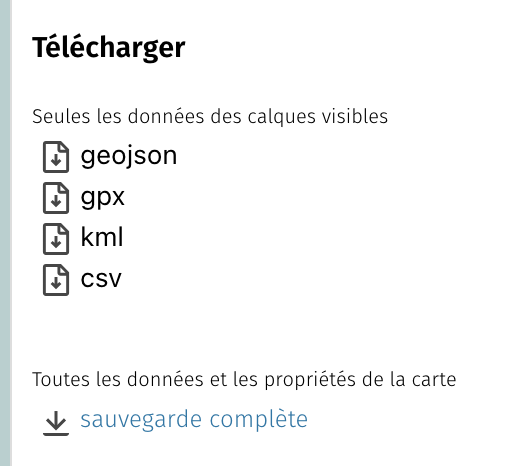

Cliquez sur « Sauvegarde complète » en bas.

### 2. Créer une carte et importer le fichier

Quitter cet écran, créer une nouvelle carte puis cliquer à droite sur « Importer des données » puis une fois l’écran latéral affiché :

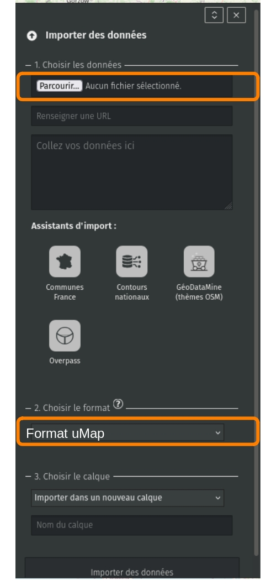

Le format de l’import reconnaît uMap et le précise.

Cliquez sur « Importer », puis enregistrez.

## 6. Cas pratique : utiliser un jeu de données placé sur data.gouv.fr

Pour un usage dans uMap, les fichiers doivent contenir les coordonnées géographiques des objets. Si le fichier choisi n’en contient pas, voir [ici](12-display-grist-data.md#2-geocoder-des-adresses-pour-les-agents-publics-seulement) comment les ajouter (géocodage).

Voici les actions pour dresser la carte des arbres remarquables à Metz : rechercher les données, les importer dans uMap et les retravailler pour améliorer le placement des étiquettes.

### Rechercher les données

La plateforme ouverte des données publiques françaises recense des milliers de jeux de données. Rechercher « Arbres Metz » dans l’outil de recherche.

Deux solutions pour utiliser ces données :

* récupérer le fichier au format json : il faudra mettre à jour la carte de temps en temps lorsque les données sources sont mises à jour. Bénéfice : une carte à jour à une date précise.

ou

* utiliser le lien vers les données : dans ce cas, la carte se mettra automatiquement à jour (suppression d’arbres coupés par exemple, ajout de nouveaux). Inconvénient : la carte est une carte au temps T, on ne conserve pas l’historique dans ce cas.

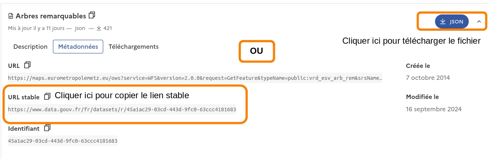

Vous avez le choix. Une fois le fichier téléchargé ou le lien copié, cliquer dans la carte sur uMap le bouton "Importer des données" dans la barre de droite puis dans le cadre au choix :

* Parcourir les fichiers téléchargés et choisir le fichier des arbres remarquables au format Geojson

ou

* Coller l’URL stable dansla ligne prévue

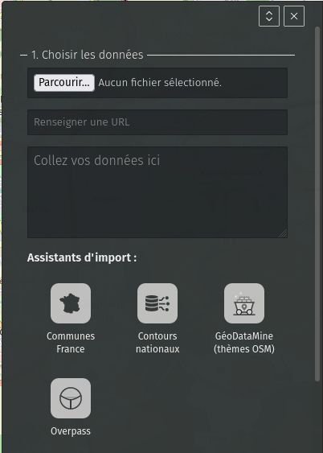
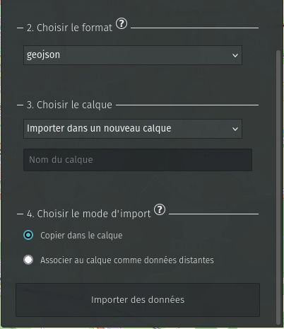

Dans « Choisir le format des données » : sélectionner `Geojson`. Dans le cas où vous choisissez l’URL stable, vous pouvez choisir `Associer au calque comme données distantes` et dans ce cas la carte se met automatiquement à jour si le fichier est modifié.

Choisir `Copier dans le calque` pour que la carte reste telle quelle à une date T.

La carte se centre automatiquement sur Metz et tous les arbres remarquables sont placés :

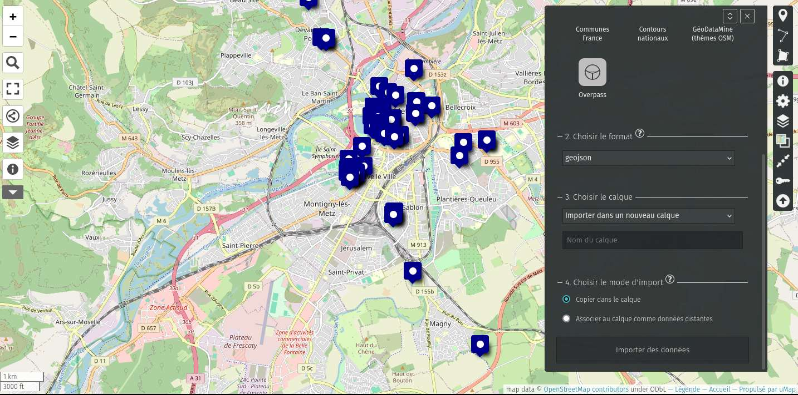

Les informations présentes dans le fichier sont répercutées et accessibles dans un tableau ou en cliquant sur chaque arbre.

### Modifier l’apparence des pointeurs pour adapter à la charte d’un site

Sélectionner le calque dans la barre de droite et modifier ses réglages en cliquant sur le petit stylo :

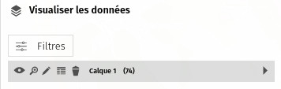

Nom : Arbres remarquables (ou par exemple Feuillus ou Arbres de plus de 50 ans…), autant de possibilités que de calques et de couleurs. Puis cliquer sur les propriétés de la forme pour choisir la couleur et la forme du pointeur, mais aussi les options d’interaction : afficher une étiquette au survol par exemple.

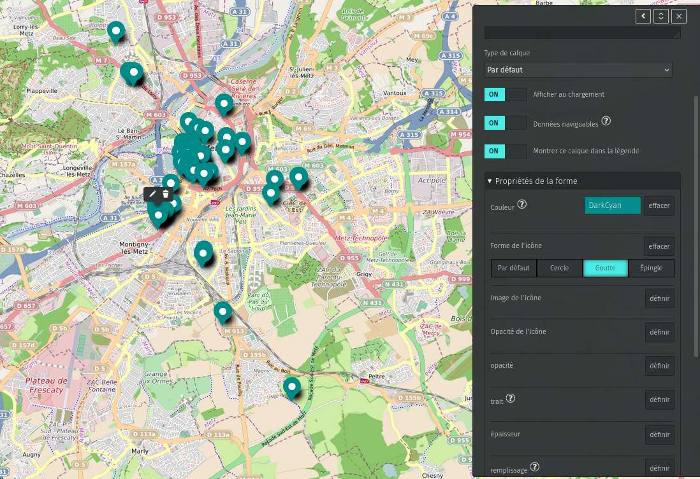

### Afficher les noms des arbres au survol

Toutes les données affichables dans l’étiquette sont présentées dans les colonnes du tableau associé au calque. Cliquez sur l’explorateur de données à gauche puis sur le visuel "Éditer dans un tableau" (juste à gauche de la corbeille):

<shot-scraper
    data-output="static/tutoriels/control-browse.png"
    data-url="https://umap.openstreetmap.fr/en/map/new/"
    data-alt="Icône du sélecteur de calque(s)."
    data-selector=".umap-control-browse"
    data-width="48"
    data-height="48"
    data-padding="5"
    >Icône du sélecteur de calque(s).</shot-scraper>

Dans le cas du fichier des arbres remarquables de Metz, le nom des arbres est renseigné comme `nom_commun` et `nom_latin`. Or dans uMap, par défaut, les étiquettes qui s’affichent utilisent `name`. Pour que le nom commun s’affiche, il faut remplacer `name` par `nom_commun` à droite dans les « Propriétés avancées » (Panneau d’information de ce calque):

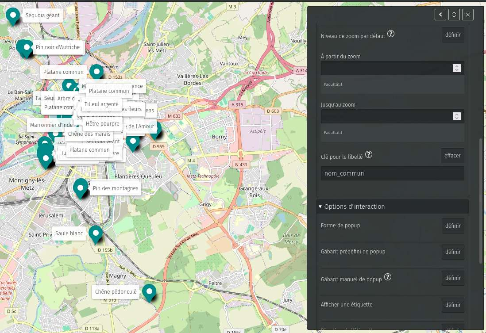

Pour que l’étiquette s’affiche seulement au survol, choisir `Caché` un peu plus bas dans « Afficher une étiquette ».

!!! note

    - Pour s’entraîner, ouvrir les réglages, la carte peut être clonée ici :
    https://umap.incubateur.anct.gouv.fr/fr/map/diaporama-des-arbres-remarquables-a-metz_528
    - Pour cloner une carte, voir l’explication au point 5 plus haut.

