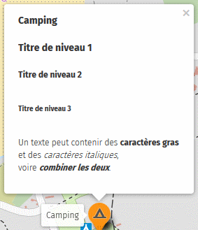
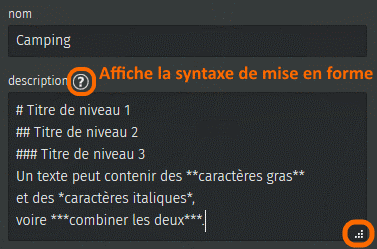
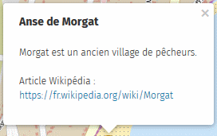
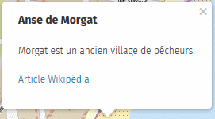
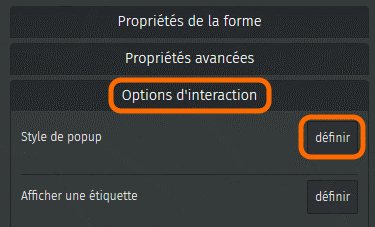
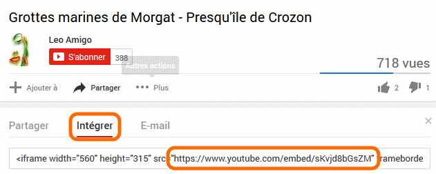
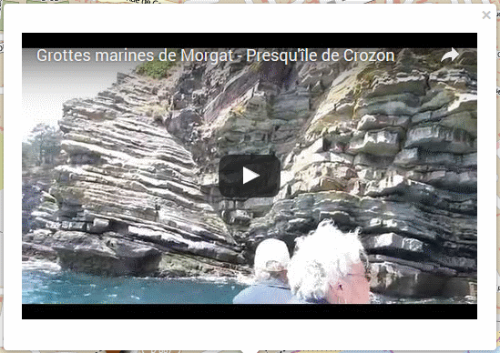

!!! abstract "Ce que nous allons apprendre"

    - Formater le texte des infobulles
    - Ajouter un lien vers une page Web
    - Insérer une photo et définir sa taille
    - Intégrer une vidéo

## Procédons par étapes

<shot-scraper
    data-output="static/tutoriels/help-box.png"
    data-url="https://umap.openstreetmap.fr/fr/map/new/"
    data-alt="Panneau d’aide au formatage."
    data-caption="Panneau d’aide au formatage."
    data-selector=".umap-dialog"
    data-width="510"
    data-height="326"
    data-padding="5"
    data-javascript="
        new Promise((takeShot) => {
            document.querySelector('.leaflet-toolbar-icon.umap-control-caption').click();
            setTimeout(() => {
                document.querySelector('.umap-field-description .umap-help-button').click();
                setTimeout(() => {
                    takeShot();
                }, 1000);
            }, 1000);
        });
    "
    >Panneau d’aide au formatage.</shot-scraper>

Nous avons vu dans
le tutoriel [Naviguer dans une carte](1-browsing-a-map.md)
comment associer un nom et
une description à un élément de la carte. Ce nom et cette description
sont affichés dans une infobulle (*popup* en anglais) qui apparaît
lorsqu’on clique sur l’élément.

Le contenu de cette infobulle peut être enrichi de plusieurs manières :

-   en formatant le texte : titres, caractères gras et italiques
-   en insérant un ou plusieurs liens vers une page Web
-   en insérant une image ou une vidéo

Mettre en forme une infobulle nécessite d’utiliser une syntaxe décrite
en cliquant sur le point d’interrogation visible à droite de l’intitulé
**description**, reprise ci-contre.

### 1. Mettre en forme le texte d’une infobulle

Un exemple
vaut mieux que de longues explications : la description ci-dessous
produit l’infobulle à droite.

Notez les points suivants :

-   une ligne commençant par `#` définit une ligne titre, un **caractère
    espace** doit être placé entre le caractère `#` et le texte du titre
-   une **zone vide** est ajoutée automatiquement en-dessous de chaque
    titre
-   il est possible de combiner caractères gras et italiques en
    utilisant `***`
-   le triangle en bas à gauche du champ de saisie permet de l’agrandir

### 2. Ajouter un lien vers une page Web

Reprenons [la carte de nos vacances à
Crozon](http://u.osmfr.org/m/64936/). Au 3ème jour de vacances un fort
vent d’Ouest nous amène à aller dans l’Anse de Morgat, bien abritée du
vent. Nous décidons de documenter cette visite sur la carte. Nous
ajoutons un marqueur sur la carte, puis découvrons avec intérêt
l’article Wikipédia sur Morgat : <https://fr.wikipedia.org/wiki/Morgat>.

Pour
ajouter à notre infobulle **un lien vers l’article**, il suffit de
copier l’adresse de la page Web, affichée dans la barre d’adresse du
navigateur, et de la placer entre **double-crochets**. L’infobulle à
droite correspond à la description ci-dessous :

    Morgat est un ancien village de pêcheurs.

    Article Wikipédia :
    [[https://fr.wikipedia.org/wiki/Morgat]]

Nous pouvons aussi **cacher l’adresse du lien** et la remplacer par un
texte. Pour cela il suffit de faire suivre l’adresse d’une barre
verticale (AltGr + 6 sur un clavier français) et du texte :

    Morgat est un ancien village de pêcheurs.

    [[https://fr.wikipedia.org/wiki/Morgat|Article Wikipédia]]

Cette forme est particulièrement utile pour les adresses longues.

### 3. Insérer une image

Umap ne permet pas de stocker des images, mais sait afficher des photos
publiées sur un serveur Web.

L’article
Wikipédia montre une belle photo de l’Anse de Morgat. Les photos
visibles dans Wikipédia sont sous licence libre *[Creative
Commons](http://creativecommons.fr/)*. Cela signifie que l’auteur·rice
de la photo renonce à ses droits d’auteur : nous pouvons donc utiliser
cette photo. Pour cela nous devons :

1.  copier l’**adressse de l’image** (cette opération est accessible
    dans le menu affiché par un clic droit sur la photo)
2.  placer cette adresse entre double accolades :

        Morgat est un ancien village de pêcheurs.

        {{https://upload.wikimedia.org/wikipedia/commons/thumb/2/22/Morgat_8006.jpg/330px-Morgat_8006.jpg}}

        [[https://fr.wikipedia.org/wiki/Morgat|Article Wikipédia]]

#### Afficher vos photos

Si vous disposez d’un serveur vous pouvez l’utiliser stocker vos photos.

#### Modifier la taille d’une image

La taille de la photo est
restreinte par la taille de l’infobulle. Pour **agrandir une image**
vous devez utiliser une infobulle plus grande. Pour cela ouvrez l’onglet
`Options d’interaction`, cliquez sur `Définir` en face de
`Style de popup` puis choisissez **Nom et description (large)**.

A l’inverse vous pouvez **réduire la taille d’une image**, en faisant
suivre le lien vers la photo d’une barre verticale et d’un nombre qui
définit la **largeur en pixels** de l’image, par exemple :

    {{https://framapic.org/xxx/yyy.jpg|400}}

#### Associer une image à un lien vers une page Web

Il est possible d’intégrer une image qui ouvre une page Web lorsque
l’utilisateur clique dessus. Cela consiste en fait à créer un lien vers
une page Web (syntaxe `[[lien|texte]]`), en utilisant en guise de texte
le lien vers une image (syntaxe `{{image}}`). Exemple avec le site et le
logo Framasoft :

    [[https://framasoft.org/|{{https://framasoft.org/nav/img/logo.png}}]]

### 4. Insérer une vidéo

Insérer une vidéo est plus complexe. En effet le navigateur Web a besoin
d’un lecteur pour afficher une vidéo. Les sites de partage de vidéos
comme Youtube, DailyMotion ou encore [Framatube](https://framatube.org/)
de Framasoft, proposent pour chaque vidéo un lien qui permet de
l’intégrer dans une autre page Web en utilisant une *iframe*.

Nous trouvons sur YouTube une [vidéo des Grottes marines de
Morgat](https://www.youtube.com/watch?v=sKvjd8bGsZM), qui se visitent en
bateau. Pour intégrer cette vidéo à une infobulle, suivez les étapes :

1.  ouvrez l’onglet **Intégrer** visible *sous* la vidéo
2.  copiez l’adresse après `src=` (sans les guillemets), notez qu’elle
    comporte le terme *embed* qui signifie *intégrer*
    
3.  coller cette adresse entre **triple accolades** dans l’infobulle :

        {{{https://www.youtube.com/embed/sKvjd8bGsZM}}}

4.  pour un meilleur résultat utilisez un style de popup large, notez la
    hauteur et la largeur et définissez la taille de l’*iframe* avec les
    mêmes valeurs :

        {{{https://www.youtube.com/embed/sKvjd8bGsZM|315*560}}}

Voici le résultat, la vidéo peut être directement visionnée dans notre
infobulle :

## Faisons le point

Nous avons à présent tous les éléments pour produire une belle carte,
avec des éléments stylisés et les infobulles qui les décrivent avec un
contenu mis en forme et multimédia : liens, photos et vidéos.

La syntaxe permettant de mettre en forme une infobulle est certes un peu
complexe, mais la bonne nouvelle est que cette même syntaxe peut être
utilisée sur uMap en deux autres endroits :

-   la description de la carte, définie dans le menu **Éditer les
    paramètres**
-   le descriptif des **calques**, que nous découvrons dans le
    [prochain tutoriel](6-handling-datalayers.md).

??? info "Licence"

    Travail initié par Antoine Riche sur [Carto’Cité](https://wiki.cartocite.fr/doku.php?id=umap:5_-_je_cree_des_infobulles_multimedia) sous licence [CC-BY-SA 4](https://creativecommons.org/licenses/by-sa/4.0/deed.fr).
