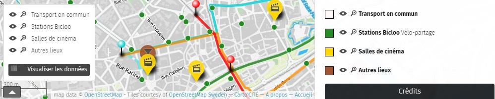
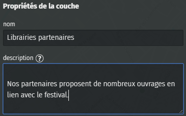
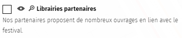
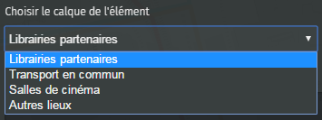
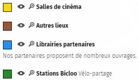
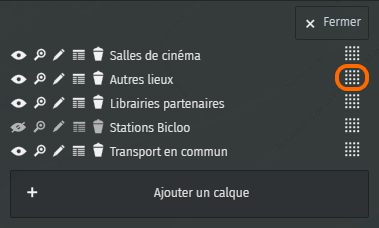
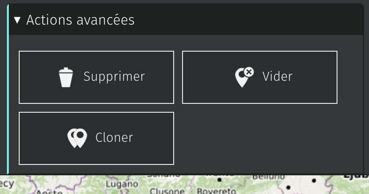

!!! abstract "Ce que nous allons apprendre"

    - Créer des calques et organiser le contenu de la carte
    - Définir les propriétés d’un calque
    - Gérer les calques d’une carte

## Procédons par étapes

### 1. Créer un calque

Reprenons la [carte du Festival des 3 continents](http://u.osmfr.org/m/26381/)
vu dans le tutoriel [Naviguer dans une carte](1-browsing-a-map.md). Les
données de cette carte sont organisées en plusieurs calques :

-   les cinémas : marqueurs jaunes
-   les autres lieux du festival : marqueurs bruns
-   les lignes de transport en commun
-   les stations de vélo-partage Bicloo

Le sélecteur de calques permet à l’utilisateur de zoomer sur l’ensemble
des éléments d’un calque, de le masquer ou l’afficher à loisir. Chaque
calque peut être décrit dans le panneau latéral de la carte. Organiser
les éléments d’une carte est donc pratique pour consulter la carte, nous
verrons aussi que cela permet de faciliter sa création.

<shot-scraper
    data-output="static/tutoriels/control-browse.png"
    data-url="https://umap.openstreetmap.fr/en/map/new/"
    data-alt="Icône du sélecteur de calque(s)."
    data-selector=".umap-control-browse"
    data-width="48"
    data-height="48"
    data-padding="5"
    >Icône du sélecteur de calque(s).</shot-scraper>

Le menu **Gérer les calques**, disponible en mode édition, affiche la liste des calques
existants et permet de créer un nouveau calque. Cliquez ensuite sur
**Ajouter un calque**, apparaît alors le panneau **Propriétés du calque**
du nouveau calque.

Saisissez le nom du calque et une description de la catégorie d’éléments
auxquels vous destinez ce calque : ils seront affichés dans le panneau
**À propos**. Ci-dessous le résultat correspondant aux propriétés
saisies à droite.

!!! note
    Sautez une ligne en début de description
    pour celle-ci apparaisse **sous** le nom du calque et non à côté dans le
    panneau À propos.

### 2. Organiser le contenu de la carte

Lorsque vous
ajoutez un élément à la carte, en haut du panneau de propriétés de
l’élément se trouve un **menu déroulant** qui vous permet de choisir le
calque où placer l’élément.

Il est bien sûr possible de changer le calque d’un élément déjà créé.
N’hésitez donc pas, lorsque votre carte s’enrichit, à *restructurer* son
contenu en plusieurs couches.

#### Comment définir les calques d’une carte ?

Il n’y a pas de méthode établie pour définir les calques : cela dépend
vraiment des données placées sur la carte et de l’expérience du
cartographe. Voici, pour quelques thématiques de cartes et à titre
d’exemples, une proposition de listes de calques :

-   tourisme : hébergement, restauration, transports, musées, points de
    vue…
-   logistique d’un festival : accès, scènes, restauration, sanitaires,
    déchets, postes de secours, réseau électrique…
-   événement à portée internationale : un ou plusieurs calques par
    langue
-   structures d’un réseau : structures porteuses, adhérentes au réseau,
    partenaires
-   projet d’aménagement : les différents scénarios ou variantes du
    projet

Nous verrons plus loin que lorsqu’une carte est intégrée à une page Web,
il est possible de créer plusieurs présentations de la même carte, et de
sélectionner pour chacune quels calques sont visibles. Vous pourrez
donc, à partir d’une même carte uMap, diffuser plusieurs cartes dont le
contenu est adapté au public visé par chacune des cartes.

Ainsi pour une carte multi-lingues vous pourrez diffuser la carte en
différentes langues en sélectionnant le ou les calques de chaque langue.
Pour l’exemple d’une carte de la logistique d’un festival, vous pourrez
ainsi diffuser une carte vers le public (accès, scènes, restauration,
sanitaires), une autre vers les équipes techniques (sanitaires, déchets,
réseau électrique), une troisième vers la sécurtié civile (accès, postes
de secours, réseau électrique), etc.

### 3. Définir les propriétés d’un calque

Un intérêt majeur de l’utilisation des calques est la possibilité de
définir, pour chaque calque, le **style par défaut** des éléments qui
seront ajoutés au calque. Vous éviterez ainsi la tâche fastidieuse de
définir un à un le style de chaque élément et la carte sera nettement
plus *lisible* car homogène. Surtout, si vous décidez que les cinémas
doivent être affichés non plus en jaune mais en rouge, vous ne ferez la
modification qu’une seule fois pour l’ensemble du calque et non pour
chacun des éléments.

Dans le
panneau de gestion des calques cliquez sur le crayon pour éditer les
propriétés du calque. Les onglets **Propriétés de la forme** et
**Propriétés avancées** vous permettent de définir les styles par défaut
du calque. Vous retrouvez les mêmes propriétés que celles utilisées dans
le tutoriel [Créer un compte](3-create-account.md).

Toutes les propriétés, qui
s’appliquent aux marqueurs, aux lignes et aux polygones, sont ici
disponibles. Un calque peut en effet contenir indifféremment les trois
types d’éléments, vous pouvez donc définir les propriétés par défaut
pour chaque catégorie.

Une remarque toutefois : vous pouvez définir **une et une seule
couleur**, qui s’applique à tous les éléments quel que soit leur type.
Cette contrainte vise à créer une carte lisible, en associant une
couleur à chaque calque. Cette couleur apparaît en **légende du panneau
À propos**, comme dans l’exemple ci-contre.

### 4. Gérer les calques

Revenons au **panneau de gestion des calques**. Nous avons vu comment
créer un nouveau calque et définir ses propriétés.

Le carré à droite permet de modifier l’**ordre des calques** par un
glisser-déposer. L’ordre ainsi défini est celui que l’on retrouve dans
le sélecteur de calques et dans la liste des calques du panneau À
Propos.

L’œil permet de cacher/afficher un calque et la loupe de zoomer sur son
contenu, comme pour le sélecteur de calques. Nous verrons plus loin
l’utilité d’**Éditer dans un tableau** le contenu du calque. **Supprimer
le calque** vous demandera de confirmer l’opération, cette opération
supprimant le contenu du calque.

Enfin, l’onglet **Actions avancées** permet de vider un calque : cela
supprime ses données mais conserve le calque. Vous pouvez également
**cloner un calque** : cette opération copie le contenu et les
propriétés du calque.

!!! note
    Pour créer rapidement un nouveau calque dont
    les propriétés sont proches d’un calque existant, vous pouvez cloner le
    calque initial puis renommer le clone et vider son contenu.

## Faisons le point

S’il est un peu abstrait, le concept de calques est un des atouts de
uMap. Au moment de créer un carte, prenez le temps de définir les
principaux calques en anticipant les usages et les mises à jours de la
carte. Familiarisez-vous à l’utilisation des calques, nous en ferons une
grande utilisation dans le niveau avancé.

Nous avons à présent tous les éléments pour réaliser des cartes
structurées, utiles, dont le contenu est riche et joli. Il est temps
d’apprendre à publier une carte sur un site internet, c’est l’objet du
[prochain tutoriel](7-publishing-and-permissions.md).

??? info "Licence"

    Travail initié par Antoine Riche sur [Carto’Cité](https://wiki.cartocite.fr/doku.php?id=umap:6_-_je_structure_ma_carte_avec_des_calques) sous licence [CC-BY-SA 4](https://creativecommons.org/licenses/by-sa/4.0/deed.fr).
