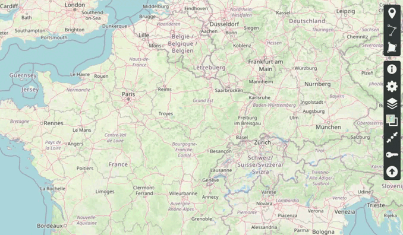
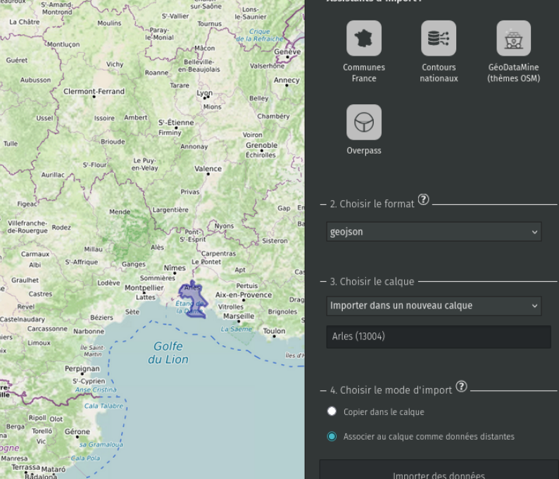
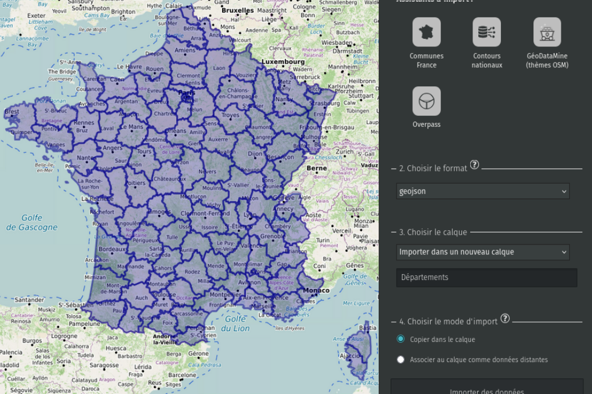
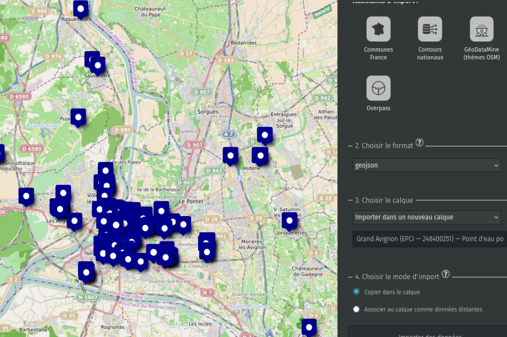

!!! abstract "Ce que nous allons apprendre"

    - Importer le contour d’une commune
    - Importer les contours des départements ou des régions
    - Importer un point d’intérêt (bibliothèques, parkings, …) qui est enregistré sur OpenStreetMap

## Procédons par étapes

Il est conseillé de vérifier si les données n’existent pas avant de se lancer dans leur dessin. On peut gagner un temps précieux avec l’assistant d’importation intégré dans uMap et conserver une carte qui n’est pas trop lourde au chargement.

Voilà les deux actions à effectuer une fois une carte préexistante, ou une nouvelle carte vierge ouverte :

- Cliquez sur l’outil d’import de données dans la barre de droite puis sélectionnez les données déjà prêtes à l’emploi
- Cliquez sur « Importer » et le cas échéant enjolivez la carte, car des figurés par défaut sont utilisés

uMap permet d’utiliser des données produites par de nombreux services et placées en open data sous différents formats. Nous verrons ultérieurement (niveau intermédiaire) où rechercher ces sources. D’ores et déjà, vous pouvez utiliser l’assistant d’importation pour récupérer en un clic des contours administratifs et des points d’intérêt.

### Ressources disponibles (20/09/2024)

Au 20 septembre 2024, les imports suivants sont disponibles :

- contour d’une commune
- contours des départements et des régions
- données issues d’OpenStreetMap placées dans [GeoDataMine](https://geodatamine.fr/). Comme son nom l’indique, GeoDataMine est une véritable mine de données très utiles pour les services publics :
    - Aire de jeux
    - Aménagements cyclables
    - Banques et DAB
    - Base Adresse
    - Bibliothèques
    - Cimetière
    - Cinémas
    - Commerces
    - Covoiturage
    - Déchets et recyclage… jusqu’à Toilettes
- overpass : pour se familiariser avec les types de requêtes à renseigner dans l’assistant, consulter les tutos plus avancés et la [page wiki](https://wiki.openstreetmap.org/wiki/Overpass_turbo/Wizard)

!!! note
    Il manque des données ? N’hésitez pas à contribuer pour les ajouter et vous en serez les premiers bénéficiaires !

### Cliquez sur l’outil d’import des données

Voici un bref passage en revu des différents imports proposés et pour finir l’import de la localisation des bibliothèques de Clermont- Ferrand :

## 1. Importer le contour d’une commune

Cliquez sur l’outil d’importation en bas de la barre de droite, puis cliquez sur le lien « Assistants d’import ».

Cliquez sur « Communes France » et sélectionnez la commune souhaitée dans une liste déroulante. Une fois la commune sélectionnée, le format est reconnu automatiquement (geojson) puis le type de calque (cliquer sur « ? » pour savoir quel choix opérer)

1. Pour que les données soient simplement copiées, choisir « Copier dans le calque ».
2. Pour que la carte évolue si le contour change, choisir « Associer au calque comme donnée distante ».

!!! note
    Le code affiché n’est pas le code postal mais le code INSEE de la commune.

Voici le résultat avec la commune d’Arles (la plus vaste de France métropolitaine, un gain certain si on fait l’économie de dessiner son contour !)

Une fois cet import réalisé, tout est réglable : couleur de contour, de fond, affichage oui non d’une étiquette.

## 2. Importer les contours des départements ou des régions

Cliquez sur l’outil d’importation en bas de la barre de droite, puis cliquez sur le lien « Assistants d’import ».

Cliquez sur « Contours nationaux » puis soit départements, soit régions et enfin le type de calque (voir supra l’explication). Tous les départements sont importés :

## 3. Importer un point d’intérêt issu de GeoDataMine

Cliquez sur l’outil d’importation en bas de la barre de droite, puis cliquez sur le lien « Assistants d’import ».

Cliquez sur « GeoDataMine (thèmes OSM) » et sélectionnez les informations souhaitées, routes, bâtiments, commerces, services publics, …
Par exemple, en sélectionnant les points d’eau potable de la CA du Grand Avignon, puis « Copier dans un calque »

Voici une réelle économie de temps plutôt que de placer pointeur après pointeur tous les points d’eau.

## 4. La carte combinée

Bien entendu, on peut tout à fait combiner les différentes couches d’information et présenter par exemple la carte des Points d’eau potable dans la CA du Grand Avignon, avec les contours des communes qui composent l’EPCI, du département et de la région :

### Points d’eau potable du Grand Avignon

[Voir la carte en plein écran](https://umap.openstreetmap.fr/fr/map/points-deau-potable-grand-avignon_1116739?scaleControl=false&miniMap=false&scrollWheelZoom=true&zoomControl=true&editMode=disabled&moreControl=true&searchControl=null&tilelayersControl=null&embedControl=null&datalayersControl=true&onLoadPanel=none&captionBar=false&captionMenus=true#11/43.9889/4.7962){ .md-button }

Il faudra dans ce cas supprimer toutes les informations inutiles dans le tableau de données qui est accessible dans la barre de gauche pour chaque calque.

Pour gagner du temps : sélectionner tous les départements et désélectionner seulement le Vaucluse, puis cliquer sur « Supprimer les lignes sélectionnées ».

