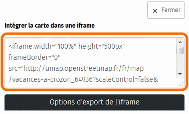
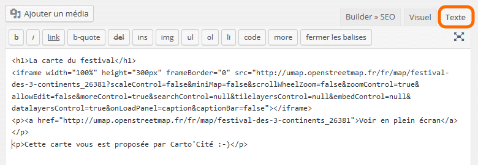
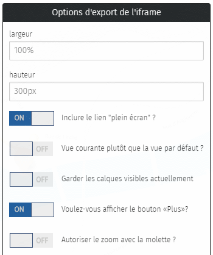

!!! abstract "Ce que nous allons apprendre"
    - Insérer une carte dans une page HTML
    - Publier une carte sur Wordpress
    - Adapter les fonctionnalités de la carte
    - Définir qui peut voir ou modifier la carte

## Procédons par étapes

### 1. Insérer une carte dans une page HTML

Nous avons vu dans le tutoriel
[Naviguer dans une carte](1-browsing-a-map.md) que
le menu de partage permet d’*embarquer une carte en iframe*, sans donner
plus de détail. Voyons comment cela se passe.

<shot-scraper
    data-output="static/tutoriels/control-embed.png"
    data-url="https://umap.openstreetmap.fr/en/map/new/"
    data-alt="Icône du partage et de l’intégration."
    data-selector=".leaflet-control-embed"
    data-width="48"
    data-height="48"
    data-padding="5"
    >Permet de partager la carte ou d’en exporter les données.</shot-scraper>

Une **iframe** est une balise du langage informatique HTML qui permet
d’intégrer (embarquer) le contenu d’une page Web dans une autre page
Web. C’est en fait très simple et nous avons déjà utilisé ce mécanisme
pour intégrer une vidéo dans le tutoriel
[Infobulles multimedia](5-multimedia-tooltips.md).

Voici les étapes à suivre :

1.  ouvrir le panneau **Exporter et partager la carte**
2.  copier la totalité du texte sous **Intégrer la carte dans une
    iframe** (astuce: placer le curseur sur le texte puis utiliser les
    raccourcis clavier <kbd>Ctrl</kbd>+<kbd>a</kbd> pour tout sélectionner
    puis <kbd>Ctrl</kbd>+<kbd>c</kbd> pour copier la sélection)
3.  coller le texte copié dans le code source du fichier HTML dans
    lequel vous souhaitez intégrer la carte (raccourci clavier: <kbd>Ctrl</kbd>+<kbd>v</kbd>)

Voici un exemple minimaliste de fichier HTML dans lequel l’iframe d’une
carte uMap à été intégrée :

    <!DOCTYPE html>
    <html>
        <head>
            <title>Exemple de carte uMap intégrée à une page Web</title>
            <meta charset="UTF-8">
        </head>
        <body>
            

                <h1>La carte du festival</h1>
                <iframe width="100%" height="300px" frameBorder="0" src="https://umap.openstreetmap.fr/fr/map/festival-des-3-continents_26381?scaleControl=false&miniMap=false&scrollWheelZoom=false&zoomControl=true&allowEdit=false&moreControl=true&searchControl=null&tilelayersControl=null&embedControl=null&datalayersControl=true&onLoadPanel=caption&captionBar=false"></iframe>
                
<a href="http://umap.openstreetmap.fr/fr/map/festival-des-3-continents_26381">Voir en plein écran</a>

                
Cette carte vous est proposée par Carto’Cité :-)

            

        </body>
    </html>

Voici la carte intégrée sur cette page, en utilisant les options
d’export par défaut :

    <h1>La carte du festival</h1>
    <iframe width="100%" height="300px" frameBorder="0" src="https://umap.openstreetmap.fr/fr/map/festival-des-3-continents_26381?scaleControl=false&miniMap=false&scrollWheelZoom=false&zoomControl=true&allowEdit=false&moreControl=true&searchControl=null&tilelayersControl=null&embedControl=null&datalayersControl=true&onLoadPanel=caption&captionBar=false"></iframe>
    
<a href="http://umap.openstreetmap.fr/fr/map/festival-des-3-continents_26381">Voir en plein écran</a>

    
Cette carte vous est proposée par Carto’Cité :-)

Bien entendu cela suppose de connaître un peu HTML et de disposer d’un
serveur sur lequel publier un tel fichier. Mais le principe est posé et
pas si compliqué. Voyons maintenant un cas de figure plus courant.

### 2. Publier une carte sur WordPress

Publier une carte sur un site WordPress se passe de la même façon que
ci-dessus, en copiant le *code HTML de l’iframe* dans l’éditeur
WordPress. Il est par contre nécessaire d’**utiliser l’éditeur textuel**
(onglet Texte) et non l’éditeur visuel.

Publiez la page et le tour est joué !

!!! note
    Pour des raisons de sécurité, les sites mutualisés
    comme <https://fr.wordpress.com/> n’autorisent pas l’inclusion d’iframe.
    Il vous sera donc impossible de publier une carte uMap sur de tels
    sites.

### 3. Adapter les fonctionnalités de la carte

La carte intégrée ci-dessus n’est pas très pratique : sa hauteur est
insuffisante et le panneau latéral est partiellement visible. Les
boutons disponibles à gauche ne sont pas forcément adaptés, par exemple
nous ne souhaitons pas intégrer le sélecteur de calques.

L’onglet **Options d’export de l’iframe** permet de contrôler tout cela.
Certaines de ces options correspondent aux **Options d’interface** vu
dans le tutoriel
[Personnaliser sa carte](4-customize-map.md). Il suffit
d’activer ces options pour que le *code d’import de l’iframe* soit
modifié. Une fois les options choisies, copiez ce code puis intégrez-le
dans celui votre page Web.

Les premières options sont spécifiques à l’export par iframe et méritent
d’être commentées :

-   la **largeur** de 100% permet d’utiliser toute la largeur disponible
    de la page. Vous pouvez définir une largeur fixe en remplaçant le
    texte par une largeur en pixels, par exemple `800px`
-   le **lien "plein écran"** désigne le lien `Voir en plein écran`
    placé sous la carte. Celui-ci permet à l’utilisateur d’afficher la
    carte uMap telle nous l’avons vue jusqu’ici.
-   l’option **Vue courante plutôt que vue par défaut** permet
    d’appliquer le position et le niveau de zoom actuel de la carte à
    l’export. Cette option est par exemple intéressante pour produire
    plusieurs zooms d’une même carte.
-   l’option **Garder les calques visibles actuellement** permet de
    choisir les calques inclus dans la carte exportée. Cette option est
    utile pour produire plusieurs cartes pour plusieurs profils
    d’utilisateurs.
-   **Autoriser le zoom avec la molette** est peu adapté si la carte est
    intégrée dans une longue page, que les utilisateurs vont faire
    défiler avec la molette : arrivé à la carte la page ne défilera plus
    et la carte va effectuer un zoom arrière. Rien de grave mais ce
    comportement peut être surprenant.

!!! note
    Lorsque les options **Vue courante plutôt que vue par
    défaut** et **Garder les calques visibles actuellement** sont actives,
    modifier la vue courante ou les calques visibles ne modifie pas le code
    d’export. Vous devez désactiver puis réactiver l’option pour prendre en
    compte ces modifications.

Voici par exemple la même carte que ci-dessus, avec une vue et un choix
de calque différents, et la plupart des options désactivées. Il est
possible de déplacer la carte mais pas de zoomer ni modifier les
calques.

<iframe width="600px" height="400px" frameBorder="0"
    src="https://umap.openstreetmap.fr/fr/map/festival-des-3-continents_26381?scaleControl=false&miniMap=false&scrollWheelZoom=false&zoomControl=null&allowEdit=false&moreControl=false&searchControl=null&tilelayersControl=null&embedControl=null&datalayersControl=false&onLoadPanel=none&captionBar=false&datalayers=53329%2C53328&locateControl=null&fullscreenControl=false#15/47.2132/-1.5503"
    ></iframe>

### 4. Définir qui peut voir ou modifier la carte

<shot-scraper
    data-output="static/tutoriels/map-permissions.png"
    data-url="https://umap.openstreetmap.fr/fr/map/new/"
    data-alt="Bouton de gestion des permissions."
    data-width="46"
    data-height="47"
    data-selector=".leaflet-toolbar-icon.update-map-permissions"
    data-padding="5"
    >Bouton de gestion des permissions.</shot-scraper>

Le bouton **Changer
les permissions et les éditeurs** donne accès au panneau **Permissions
de la carte**. Celui-ci vous permet de contrôler, pour chaque carte, qui
peut la voir et qui peut la modifier.

<shot-scraper
    data-output="static/tutoriels/map-permissions-panel.png"
    data-url="https://umap.openstreetmap.fr/fr/map/new/"
    data-alt="Panneau des permissions."
    data-caption="Panneau des permissions."
    data-width="410"
    data-height="414"
    data-selector=".panel.right"
    data-padding="5"
    data-wait-for="document.querySelector('.panel.right')"
    data-javascript="
        new Promise((takeShot) => {
            document.querySelector('.leaflet-control-edit-save').click();
            document.querySelector('#umap-alert-container').style.display='none';
            setTimeout(() => {
                document.querySelector('.leaflet-toolbar-icon.update-map-permissions').click();
                setTimeout(() => {
                    takeShot();
                }, 1000);
            }, 1000);
        });
    "
    >Panneau des permissions.</shot-scraper>

Lorsque vous créez une carte celle-ci est visible dans votre *catalogue*
de cartes, dont l’adresse est
`http://umap.openstreetmap.fr/fr/user/<votre-compte>/` : l’option **Tout
le monde (public)** du menu déroulant **Qui a accès** est sélectionnée.
Les autres options de ce menu sont :

-   **quiconque a le lien** : la carte n’apparaît plus dans votre
    catalogue mais les personnes connaissant son lien peuvent la
    consulter.
-   **seulement les éditeurs** : seules les personnes ayant le droit
    d’éditer la carte, et identifiées comme telles, peuvent consulter la
    carte. Toute autre personne se verra refuser l’accès. N’utilisez pas
    cette option si vous intégrez la carte dans une iframe.

Lorsque vous créez une carte, vous êtes le seul à pouvoir la modifier.
Vous pouvez inviter d’autres utilisateurs à la modifier en sélectionnant
l’option **Seuls les éditeurs peuvent éditer** dans le menu **Statut
d’édition**, puis en saisissant un à un le nom de compte des
utilisateurs invités dans le champ **Éditeurs**.

Le nom de chaque utilisateur est ajouté à la suite de ce champ.

L’option **Tout le monde peut éditer** du menu **Statut d’édition** est
utile pour créer une carte collectivement.

!!! note
    uMap ne permet pas à plusieurs éditeurs de modifier la
    carte simultanément. Le logiciel vous alerte lorsque l’opération
    **Enregistrer** risque d’écraser les modifications d’un autre
    utilisateur, vous devez alors choisir entre ses modifications (en
    validant Enregistrer) ou les vôtres (en annulant).

    Si vous êtes plusieurs éditeurs d’une même carte, concertez-vous avant
    de modifier la carte.

Enfin vous pouvez **tranférer la propriété** d’une carte à un autre
utilisateur : supprimez le propriétaire actuel (vous) en cliquant sur la
petite croix à droite du champ **Owner**, puis saisissez le nom de
compte de l’utilisateur à qui vous donnez la carte.

## Faisons le point

À ce stade nous savons créer une carte structurée avec du contenu
multimédia, nous savons la publier et l’intégrer à une page Web, nous
savons même la modifier collectivement. Nous allons bientôt pouvoir
passer au niveau avancé, dans lequel nous allons apprendre à **importer
des données** dans une carte et explorer les capacités d’ouverture de
uMap.

Mais avant cela, nous allons terminer le niveau intermédiaire en
traitant [le cas des polygones](8-polygons.md).

??? info "Licence"

    Travail initié par Antoine Riche sur [Carto’Cité](https://wiki.cartocite.fr/doku.php?id=umap:7_-_je_publie_ma_carte_et_en_controle_l_acces) sous licence [CC-BY-SA 4](https://creativecommons.org/licenses/by-sa/4.0/deed.fr).

