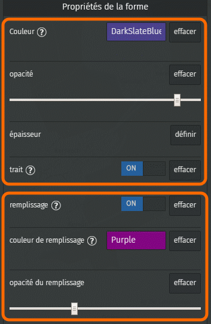
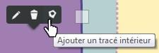
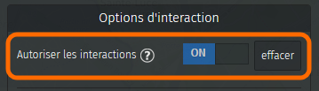
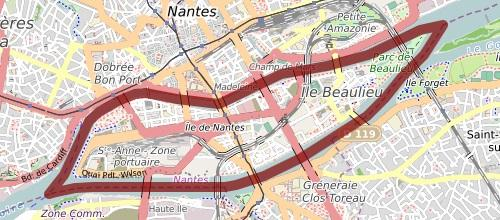
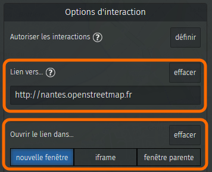
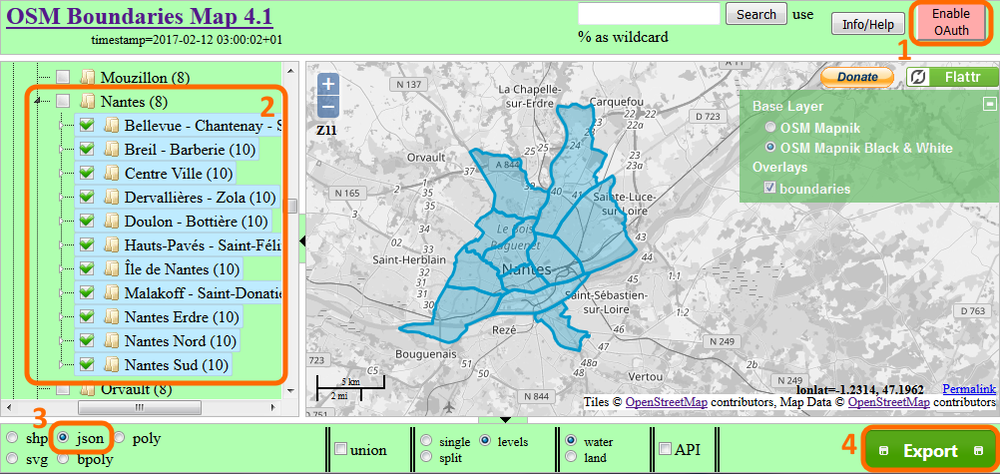
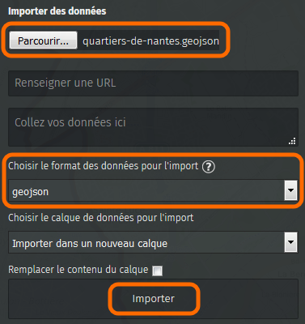
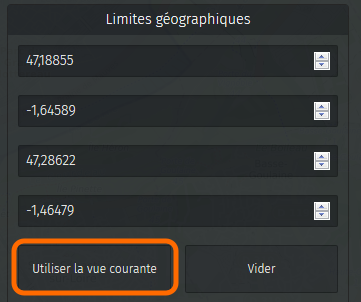

!!! abstract "Ce que nous allons apprendre"

    - Créer un polygone et le modifier
    - Styliser un polygone : remplissage et contour(s)
    - Associer une URL à un polygone
    - Extraire des limites administratives d’OpenStreetMap
    - Importer des données dans une carte

!!! question

    Pourquoi traiter les polygones à part, il ne s’agit que d’une ligne
    fermée ? Un polygone est en réalité bien plus qu’un ligne fermée. Cette
    ligne sépare l’**intérieur du polygone** de son extérieur, ceci est
    important car uMap peut réagir à un clic à l’intérieur du polygone. De
    plus un polygone être troué, il est alors défini par plusieurs lignes.

## Procédons par étapes

### 1. Créer un polygone

Revenons à la carte de nos vacances à Crozon. Un jour de beau temps nous
louons un dériveur et naviguons dans la zone définie par le club
nautique. Ajoutons cette zone à la carte.

<shot-scraper
    data-output="static/tutoriels/draw-polygon.png"
    data-url="https://umap.openstreetmap.fr/fr/map/new/"
    data-alt="Bouton de dessin de polygones."
    data-width="46"
    data-height="47"
    data-selector=".leaflet-toolbar-icon.umap-draw-polygon"
    data-padding="5"
    >Bouton de dessin de polygones.</shot-scraper>

Le bouton
**Dessiner un polygone** permet de tracer le périmètre d’un polygone
point par point, et de le terminer en cliquant à nouveau sur le dernier
point comme pour le tracé d’une ligne. Une différence toutefois : dès le
troisième point l’intérieur du polygone est coloré.

#### Propriétés d’un polygone

La liste des
propriétés d’un polygone est assez longue. Les propriétés de la moitié
supérieure du menu s’appliquent au périmètre du polygone, et sont
identiques aux propriétés s’appliquant aux lignes. Le moitié inférieure
concerne le remplissage du polygone. Noter :

-   les options **trait** et **remplissage** permettent de ne pas
    afficher le périmètre ou l’intérieur du polygone : si aucun de ces
    deux éléments est affiché le polygone est invisible.
-   la **couleur du remplissage** est par défaut celle du trait, mais
    peut être modifiée.
-   une faible **opacité du remplissage** permet de voir le fond de
    carte *sous* le polygone.

#### Trouer un polygone

Il est parfois utile de créer un ou plusieurs trous dans un polygone,
par exemple pour dessiner une clairière dans une forêt ou un île au
milieu d’un étang.

Vous pouvez créer un
polygone avec un ou plusieurs trous en cliquant sur l’option **Ajouter
un tracé intérieur** lorsque vous sélectionnez un polygone en mode
édition.

Le premier point du *périmètre intérieur* est créé directement là où
vous avez cliqué avant de choisir **Ajouter un tracé intérieur**.

Notez que les propriétés de périmètre d’un polygone s’appliquent à tous
les périmètres - extérieurs et intérieurs.

### 2. Définir les interactions avec un polygone

L’onglet **Options d’interaction** propose deux options spécifiques aux
polygones.

Toute interaction peut être désactivée en sélectionnant **OFF** pour
l’option **Autoriser les interactions**. Aucune infobulle n’est alors
affichée lors d’un clic sur le polygone. Cette option est intéressante
pour donner de l’importance à une zone de la carte sans que
l’utilisateur ne puisse interagir avec.

Voici un exemple montrant
l’Ile de Nantes entourée d’un large trait rouge et sans remplissage. Il
n’est possible de cliquer ni sur le contour ni à l’intérieur du
polygone.

!!! note
    L’interaction avec le polygone reste désactivée en mode
    édition. Pour pouvoir éditer le polygone il est alors nécessaire de
    passer par le panneau **Visualiser les données** (toujours accessible
    par le panneau de Légende lui-même accessible depuis le lien **A
    propos** en bas à droite de la carte).

À l’inverse, il est
possible d’associer à un polygone une URL : un clic sur le polygone
ouvre alors la page Web correspondante directement, sans passer par une
infobulle. Il suffit pour cela de définir le **Lien vers…** puis de
saisir l’URL. il existe trois options permettant de définir ***où***
sera ouverte la page Web :

-   **nouvelle fenêtre** : la page s’ouvre dans un nouvel onglet du
    navigateur
-   **fenêtre parente** : la page s’ouvre dans le même onglet que celui
    de la carte
-   **iframe** : si la carte est intégrée dans une iframe, la page Web
    est alors ouverte à l’intérieur de l’iframe

### 3. Réaliser un menu cartographique

Associer un URL à un polygone permet de créer un *menu cartographique*,
c’est-à-dire une carte permettant d’accéder à plusieurs pages Web selon
la zone sur laquelle clique l’utilisateur. Voici un exemple montrant les
différents quartiers de Nantes : un clic sur un quartier ouvre la page
correspondante du site <http://www.nantes.fr>.

<iframe width="500px" height="550px" frameBorder="0" src="https://umap.openstreetmap.fr/fr/map/quartiers-de-nantes_126581?scaleControl=false&miniMap=false&scrollWheelZoom=false&zoomControl=false&allowEdit=false&moreControl=false&searchControl=null&tilelayersControl=null&embedControl=null&datalayersControl=false&onLoadPanel=undefined&captionBar=false&fullscreenControl=false&datalayers=311326#12/47.24/-1.5"></iframe>

Voici les étapes pour réaliser cette carte.

#### a. Récupérer les contours des quartiers

Le contour des quartiers de Nantes provient les limites administratives
d’OpenStreetMap (pour en savoir plus, consultez cette [page du
Wiki](http://wiki.openstreetmap.org/wiki/WikiProject_France/Liste_limites_administratives)).
Le site [OSM Boundaries](https://osm-boundaries.com/) permet de
sélectionner les limites administratives une à une, puis de les exporter
dans différents formats.

Suivez ces étapes :

1.  connectez-vous à votre compte OpenStreetMap (celui-ci est exigé pour
    pouvoir exporter les limites administratives)
2.  sélectionnez les limites administratives une par une, en ouvrant
    successivement les différents niveaux : pays - région - département
    etc.
3.  sélectionez le format d’export JSON : le format
    [GeoJSON](https://fr.wikipedia.org/wiki/GeoJSON) est alors utilisé
4.  cliquez sur Export

Vous récupérez dans le dossier des téléchargements un fichier dont
l’extension est `.geojson`.

#### b. Importer les contours de quartier dans une carte

<shot-scraper
    data-output="static/tutoriels/upload-data.png"
    data-url="https://umap.openstreetmap.fr/fr/map/new/"
    data-alt="Bouton d’import de données."
    data-width="46"
    data-height="47"
    data-selector=".leaflet-toolbar-icon.upload-data"
    data-padding="5"
    >Bouton d’import de données.</shot-scraper>

Dans une nouvelle
carte, cliquez sur **Importer des données**. Dans le panneau qui appraît
alors, sélectionnez le fichier produit à l’étape précédente.

Le sélecteur de format se positionne automatiquement sur **geojson**,
sélectionnez-le si ce n’est pas le cas, par exemple parce que
l’extension du fichier n’est pas `.geojson`. Cliquez sur **Importer** :
les contours apparaissent sur la carte.

#### c. Configurer la carte uMap

Configurez le calque afin d’afficher une étiquette - au survol ou pas
selon votre choix. Ensuite éditez chaque polygone pour lui associer
l’URL vers la page Web correspondante, comme nous l’avons vu plus haut.

Enfin vous pouvez, dans les **Paramètres de la carte**, définir les
**Limites géographiques** de la carte. Cela permet d’empêcher
l’utilisateur de déplacer la carte au-delà de ces limites.

#### d. Intégrer la carte dans une iframe

Récupérez le code de l’iframe, comme nous l’avons vu dans le
[tutoriel précédent](7-publishing-and-permissions.md),
en prenant soin de désactiver toutes les options d’interaction :
boutons de zoom, zoom avec la molette, bouton « Plus », etc.

Copiez ce **code iframe** dans votre page Web, et le tour est joué !

!!! note
    Lorsque vous modifiez la carte, vous devez recharger
    entièrement la page contenant l’iframe pour vider le cache du
    navigateur, par exemple en utilisant <kbd>Ctrl</kbd>+<kbd>F5</kbd>
    sur Firefox.

## Faisons le point

Ce tutoriel marque la fin du niveau intermédiaire. Vous savez structurer
le contenu d’une carte avec des calques et utiliser des styles par
défaut. Vous savez formater les infobulles et y intégrer du multimédia.
Vous savez intégrer votre carte dans une page Web et contrôler qui peut
la voir et la modifier.

Nous venons de voir comment importer des données dans une carte, le
niveau avancé va nous permettre d’aller bien plus loin dans cette
démarche.

??? info "Licence"

    Travail initié par Antoine Riche sur [Carto’Cité](https://wiki.cartocite.fr/doku.php?id=umap:8_-_le_cas_des_polygones) sous licence [CC-BY-SA 4](https://creativecommons.org/licenses/by-sa/4.0/deed.fr).

