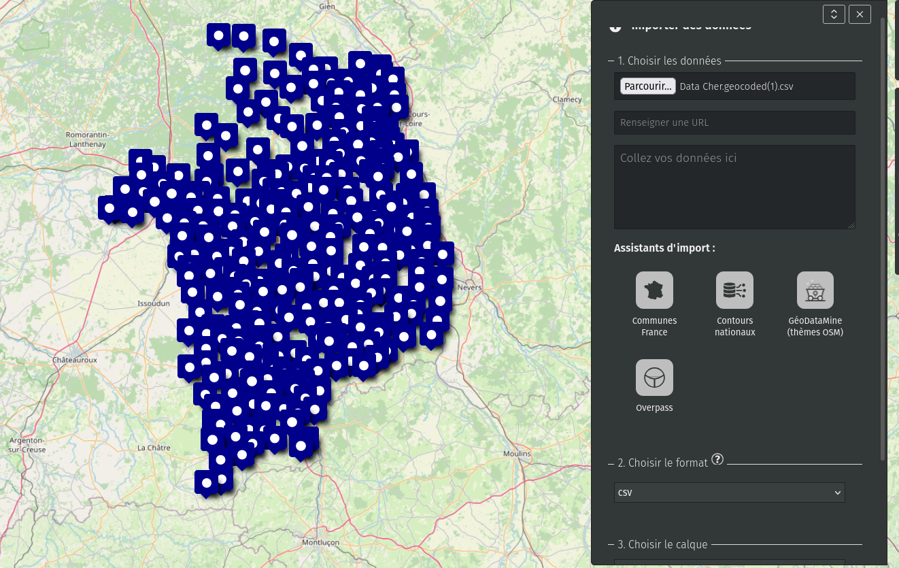
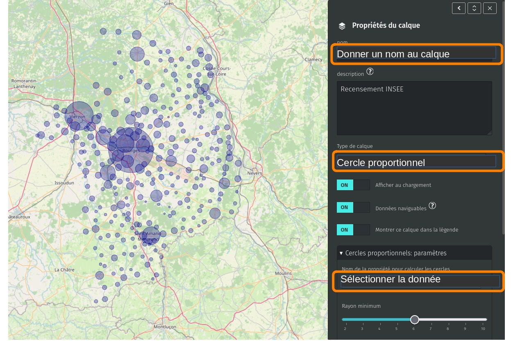

!!! abstract "Ce que nous allons apprendre"

    - Vérifier le formats du fichier
    - Importer le fichier dans uMap
    - Régler l’apparences des cercles

## Procédons par étapes

Nous allons importer des données quantitatives et les représenter sous forme de cercles proportionnels. On peut aussi représenter des données distantes par cercles proportionnels (voir les tutoriels plus avancés).

### 1. Vérifier le format du fichier

Pour être utilisable dans uMap, le fichier doit être enregistré au format `.csv`, il doit intégrer les cordonnées géographiques. Sans ces deux conditions, le fichier de données n’est pas traité.

Il faut également éviter les mises en forme du type espace entre des blocs de trois zéros, sans quoi les cercles ne seront pas proportionnels, mais tous de même taille.

Si la latitude et la longitude ne sont pas présentes, le fichier doit être géocodé.
Le site de la Base Adresse Nationale propose un outil très pratique : <https://adresse.data.gouv.fr/csv>

Il suffit de placer un fichier au format `.csv` contenant des adresses et de cliquer sur « géocodage ». L’outil en ligne ajoute les coordonnées géographiques des adresses.

### 2. Importer le fichier dans uMap

Cliquer sur l’outil d’importation en barre de droite :

<shot-scraper
    data-output="static/tutoriels/upload-data.png"
    data-url="https://umap.openstreetmap.fr/fr/map/new/"
    data-alt="Bouton d’import de données."
    data-width="46"
    data-height="47"
    data-selector=".leaflet-toolbar-icon.upload-data"
    data-padding="5"
    >Bouton d’import de données.</shot-scraper>

Puis choisir le fichier, par exemple ici la population municipale du Cher, le format est `.csv` et cliquer sur « importer » :

Toutes les communes sont représentées par un pointeur. Il reste juste à préciser que les données de ce calque doivent être affichées par cercles proportionnels. Pour ce faire, cliquer sur l’outil « Gérer les calques » en barre de droite :

<shot-scraper
    data-output="static/tutoriels/control-browse.png"
    data-url="https://umap.openstreetmap.fr/en/map/new/"
    data-alt="Icône du sélecteur de calque(s)."
    data-selector=".umap-control-browse"
    data-width="48"
    data-height="48"
    data-padding="5"
    >Icône du sélecteur de calque(s).</shot-scraper>

Puis dans le menu déroulant, sélectionner « Cercles proportionnels » et la donnée de votre tableau que vous voulez représenter en cercles proportionnels :

Il est tout à fait possible de régler la proportionnalité sur les barres de rayon minimum et maximum pour modifier le rendu : l’écart est alors amplifié ou plutôt écrasé.

!!! notes

    Pour modifier les couleurs des cercles, voir le tutoriel
    [Dessiner sur sa carte](/fr/tutorials/4-draw-items/).
