!!! abstract "Ce que nous allons apprendre"

    - Structurer des données pour pouvoir les géocoder
    - Géocoder des adresses et vérifier le résultat
    - Importer un tableau de données dans une carte uMap
    - Injecter le contenu du tableau dans les infobulles
    - Configurer le tri et le filtre des données

## Procédons par étapes

L’objectif de ce tutoriel est de créer une carte en important des
données dans uMap. Cela peut être utile dans plusieurs situations :

-   visualiser des données que vous avez trouvées sur un portail open
    data, par exemple <https://data.nantesmetropole.fr/>
-   placer sur une carte les contacts (clients, fournisseurs,
    concurrents…) que vous gérez dans un tableur

L’enjeu est de placer automatiquement chaque élément à sa **position
géographique**, définie par une **longitude** et une **latitude** (on
parle aussi de **point GPS**). Pour cela il faut que les données soient
**géocodées**, par exemple un tableau contiendra deux colonnes :
latitude et longitude.

Si les données *open data* sont parfois géocodées, ce n’est généralement
pas le cas de votre fichier de contacts qui contient des adresses. Il
est dans ce cas nécessaire de passer par une étape de **géocodage**, qui
consiste à convertir chaque adresse en latitude et longitude. Nous
allons traiter ce cas de figure, étape par étape.

### 1. Je crée un tableau avec des adresses

Pour convertir des adresses en longitude et latitude nous allons
utiliser un **géocodeur**. Celui-ci utilise une base de données
d’adresses géocodées, parmi lesquelles il recherche l’adresse à
géocoder. Voici quelques conseils à suivre pour faciliter la tâche du
géocodeur et obtenir de bons résultats :

-   répartir chaque adresse en **plusieurs colonnes** : adresse, code
    postal et ville
-   porter dans la colonne adresse le **libellé de la voie précédé du
    numéro**, par exemple `14 rue de la Paix`, ou le nom du lieu-dit
-   placer tout autre élément d’adresse (boîte postale, étage…) dans
    un autre champ

Voici par exemple quelques adresses bien structurées, provenant du
fichier [Sièges des syndicats intercommunaux de transports scolaires en
Loire-Atlantique](https://data.nantesmetropole.fr/explore/dataset/234400034_031-001_sits_shp/export/)
:

| NOM                     | ADRESSE                | COMPL_ADR                    | CP     | VILLE                     |
| ------------------------| -----------------------| -----------------------------| -------| --------------------------|
| C. C. LOIRE et SILLON   | 2 bd de la Loire       |                              | 44260  | SAVENAY                   |
| C. C. COEUR d’ESTUAIRE  | 1 Cours d’Armor        | Route de Savenay             | 44360  | SAINT ETIENNE DE MONTLUC  |
| RESEAU CAP ATLANTIC’    | 4 rue Alphonse Daudet  | Zone Tertiaire de Kerbiniou  | 44350  | GUERANDE                  |
| SITS SUD LOIRE LAC      | ZI de la Seiglerie     |                              | 44270  | MACHECOUL                 |

L’utilisation de majuscules ou minuscules n’a en général pas
d’incidence. Le tableau peut bien sûr contenir d’autres colonnes, comme
ici les colonnes NOM et COMPL_ADR.

!!! note

    Pour la suite des opérations, il est important que le
    tableur respecte les règles suivantes :

    -   la première ligne du tableur doit contenir les noms de colonnes, les
        autres lignes contiennent les données et rien d’autre
    -   les noms de colonnes ne doivent contenir ni espace ni accent ou
        autre caractère spécial
    -   les noms de colonnes doivent être tous différents
    -   les cellules ne doivent pas contenir de "retour chariot" ou "saut de
        ligne"
    -   les cellules ne doivent pas être fusionnées

    En d’autres termes, le tableur doit représenter une **base de données**.

### 2. Je convertis les adresses en coordonnées géographiques

Plusieurs **géocodeurs** sont disponibles sur internet. La qualité du
géocodage peut différer en fonction de plusieurs facteurs :

-   votre adresse est incomplète ou contient une erreur, par exemple un
    mauvais code postal
-   la base d’adresses utilisée contient des adresses erronées ou n’est
    pas à jour
-   l’algorithme chargé de comparer votre adresse à celles de la base de
    données fait de mauvaises hypothèses

Aucun géocodeur n’est parfait. Il est donc important de **vérifier la
qualité du géocodage**, voire de comparer et combiner le résultat de
plusieurs géocodeurs. La plupart des géocodeurs produisent, en
complément à chaque latitude et longitude, un score permettant d’évaluer
la qualité du résultat.

En France le site <https://adresse.data.gouv.fr> donne accès à la Base
Adresse Nationale (BAN). Il fournit plusieurs outils, dont le [géocodeur
CSV](https://adresse.data.gouv.fr/csv) qui permet de géocoder une liste
d’adresses très rapidement avec de bons résultats.

[DoGeocodeur](https://dogeo.fr/_apps/DoGeocodeur/) est un site
particulièrement bien pensé : il sait utiliser plusieurs géocodeurs
(Google, IGN, BAN…) et combiner leur résultat, afficher le résultat
sur une carte, et vous permet de positionner manuellement une adresse.
Lui aussi utilise des fichiers CSV.

!!! note
    CSV désigne un fichier texte contenant les données d’un
    tableau, dont les valeurs (le contenu de chaque cellule) sont séparées
    par des virgules (CSV signifie *comma-separated values*) … ou par un
    autre caractère : l’important est que ce **séparateur** ne soit pas
    utilisé à l’intérieur d’une valeur. Le point-virgule est souvent utilisé
    comme séparateur pour créer un fichier CSV.

Pour géocoder les adresses d’un tableau, les étapes à suivre sont :

1.  exporter le tableau dans un fichier au format CSV, en choisissant le
    séparateur (conseil : point-virgule) et le jeu de caractères
    (encodage) **UTF-8**. Inclure les entêtes de colonnes si l’option
    vous est proposée. Voici par exemple le panneau d’export CSV de
    LibreOffice Calc :
    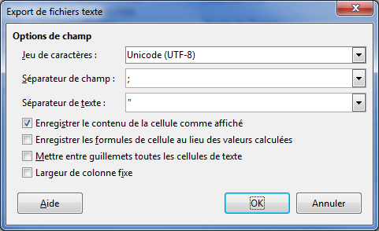
2.  importer le fichier CSV dans le site de géocodage de votre choix,
    celui-ci vous demande en général de sélectionner les noms de
    colonnes correspondant à l’adresse, au code postal et à la commune
3.  vérifier le résultat du géocodage, l’ajuster et le compléter au
    besoin
4.  exporter le résultat, qui sera lui aussi au format CSV

!!! note
    Pour exporter un fichier CSV en UTF-8 avec Microsoft
    Excel, le menu **Options Web** dans la fenêtre **Enregistrer sous**
    permet, dans l’onglet **Encodage**, de sélectionner **Unicode (UTF-8)**.
    Malheureusement cela **ne fonctionne pas pour MS Excel 2016 ni Office
    365/Excel**, il s’agit d’un [bogue
    connu](https://answers.microsoft.com/en-us/msoffice/forum/all/office-365excel-generates-incorrect-csv-utf-8/56516c38-78d8-40f5-90b3-f5d9db3d6d10).

    Pour contourner ce bogue, une possibilité est d’utiliser l’éditeur
    [Notepad++](https://notepad-plus-plus.org/) que vous devez installer. Ne
    pas changer l’encodage lors de l’export CSV, puis ouvrir le fichier dans
    Notepad++, convertir en UTF-8 dans le menu **Encodage**, enfin
    enregistrer le fichier.

### 3. J’importe le tableau géocodé dans un calque

Cliquez sur
**Importer des données** pour afficher le panneau du même nom, puis
sélectionnez le fichier précédemment géocodé.

<shot-scraper
    data-output="static/tutoriels/upload-data.png"
    data-url="https://umap.openstreetmap.fr/fr/map/new/"
    data-alt="Bouton d’import de données."
    data-width="46"
    data-height="47"
    data-selector=".leaflet-toolbar-icon.upload-data"
    data-padding="5"
    >Bouton d’import de données.</shot-scraper>

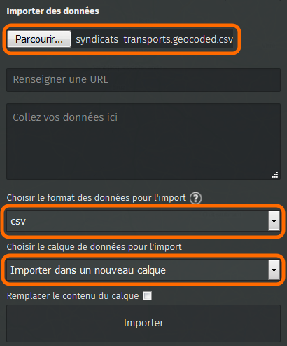

Vérifiez que uMap a bien reconnu **CSV** pour le format des données, et
choisissez de les importer dans un **nouveau calque**.

Enfin cliquez sur **Importer** : les données sont chargées puis
affichées sur la carte. Les lignes n’ayant pas de position géographique
sont ignorées, un message est alors affiché.

!!! note

    uMap utilise la première ligne du fichier CSV pour
    identifier les noms de colonnes, en particulier **latitude** et
    **longitude** qui sont utilisés pour positionner les points (**lat** et
    **lon** sont aussi compris). Vérifiez la présence de ces noms de
    colonnes si l’opération échoue. Attention également à ce que les
    coordonnées soient exprimées en **degrés décimaux**, avec un point pour
    délimiter les décimales. Exemple: 48.40 est correct mais 48,40 et 48°24’
    ne sont pas valides pour uMap.

Notez que vous pouvez directement coller les données dans le panneau
d’import. Il est cependant intéressant de passer par un fichier que vous
pouvez conserver sur votre poste.

Enfin vous pouvez réimporter les données, par exemple après les avoir
mises à jour. Sélectionnez alors le même calque et cochez la case
**Remplacer le contenu du calque**.

### 4. J’insère le contenu du tableau dans les infobulles

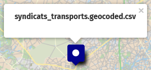

Cliquez maintenant sur un marqueur importé à l’étape précédente :
l’infobulle affiche le nom du calque (en l’occurence le nom du fichier
importé si vous ne l’avez pas renommé) au lieu du nom présent dans le
tableau de données.

Il y a plusieurs possibilités pour rémédier à cela.

#### Modifier le champ utilisé

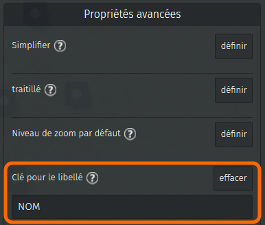

Éditez le calque et
modifiez, dans l’onglet Propriétés avancées, la **Clé pour le libellé**.
Saisissez le nom de la colonne du fichier importé. Chaque infobulle
affiche désormais le contenu de cette colonne.

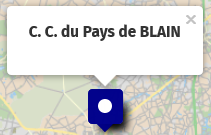

!!! note
    Respecter la casse, c’est-à-dire les majuscules et
    minuscules. Le nom de colonne ne doit pas contenir de caractère spécial
    : accents, espace, ponctuation…

#### Afficher un tableau

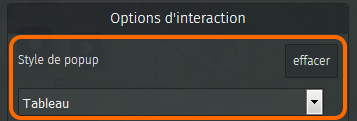

Le contenu du tableau peut
être affiché dans les infobulles, sous forme d’un tableau à deux
colonnes : l’intitulé et la valeur correspondante.

Dans l’onglet **Options d’interaction** du calque, changez le **Style de
la popup** en **Tableau**. Voici un exemple de résultat :

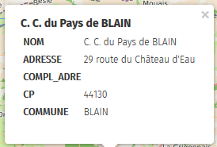

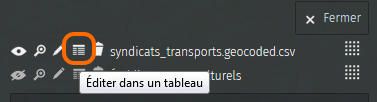

Notez que vous
pouvez modifier le contenu du tableau en cliquant sur **Éditer dans un
tableau** dans le sélecteur de calques. Vous pouvez alors supprimer ou
renommer des colonnes, voire même modifier les cellules du tableau.

#### Définir le gabarit des infobulles

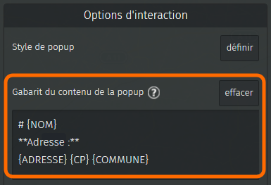

Le tableau ci-dessus n’est
pas particulièrement joli avec ses libellés en majuscules.

Dans le tutoriel [5-multimedia-tooltips.md) nous avons vu
comment formater le contenu d’une infobulle. Nous pouvons utiliser la
même syntaxe pour définir le contenu de **toutes les infobulles d’un
calque**, en y intégrant le contenu des cellules du tableau.

Dans l’onglet **Options d’interaction** du calque, éditez le **Gabarit
du contenu de la popup**. Définissez le format des popups (titres,
caractère gras, etc.) comme vu précédemment. Pour *injecter* le contenu
d’une cellule dans l’infobulle, il suffit d’ajouter le nom de la colonne
placé entre accolades, par exemple **{NOM}**.

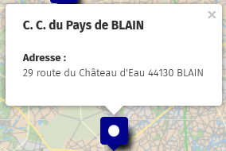

Vous pouvez utiliser dans le gabarit tous les champs du tableau. Voici à
droite un exemple de gabarit et le résultat pour une infobulle.

**Cette approche est très puissante.** Vous pouvez l’utiliser pour
injecter, pour chaque ligne du tableau, un lien vers un site internet
(et pourquoi pas le texte associé), une image ou une iframe. Il suffit
pour cela d’intégrer le nom de colonnes et ses accolades, à la syntaxe
de mise en forme du texte, par exemple `[[{LIEN_SITE}|{TEXTE_LIEN}]]` ou
encore `{{{URL_IMAGE}}}`.

### 5. Je configure le tri et les filtres

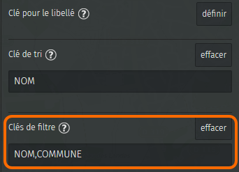

Nous avons vu dans le tutoriel
[Je consulte une carte uMap](1-browsing-a-map.md) qu’il
est possible de voir l’ensemble des données de la carte sous la forme
d’une liste. Cette liste peut aussi filtrée par l’utilisateur, à partir
d’un mot par exemple.

<shot-scraper
    data-output="static/tutoriels/map-settings.png"
    data-url="https://umap.openstreetmap.fr/fr/map/new/"
    data-alt="Bouton des options de la carte."
    data-width="46"
    data-height="47"
    data-selector=".leaflet-toolbar-icon.update-map-settings"
    data-padding="5"
    >Bouton des options de la carte.</shot-scraper>

Pour permettre aux
utilisateurs de filtrer les données il convient de préciser à uMap à
quel(s) champ(s) le "mot-filtre" doit s’appliquer. Cela s’effectue dans
l’onglet **Propriétés par défaut** des **Propriétés de la carte**. Vous
pouvez indiquer plusieurs noms de champ (noms de colonne), le filtre
s’appliquera à chacun des champs.

Notez que vous pouvez également trier la liste en sélectionnant la **Clé
de tri**, c’est-à-dire le nom de la colonne utilisée pour le tri (tri
croissant uniquement). Enfin vous pouvez définir la clé par défaut pour
le libellé, qui sera utilisée si celle-ci n’est pas définie pour le
calque.

!!! note
    Les clés de tri et de filtre s’appliquent à l’ensemble
    des données, tous calques confondus. Si votre carte est constituée de
    plusieurs calques, il est donc conseillé d’utiliser le même nom de clé
    pour désigner le même type d’information. Évitez par exemple d’utiliser
    **Ville** pour un calque et **Commune** pour un autre, utilisez plutôt
    **Commune** pour les deux.

## Faisons le point

Ce tutoriel est probablement le plus complexe de la série. Appréciez
toutefois les possibilités offertes par uMap pour intégrer des données
externes.

??? info "Licence"

    Travail initié par Antoine Riche sur [Carto’Cité](https://wiki.cartocite.fr/doku.php?id=umap:9_-_je_cree_une_carte_a_partir_dun_tableur) sous licence [CC-BY-SA 4](https://creativecommons.org/licenses/by-sa/4.0/deed.fr).
