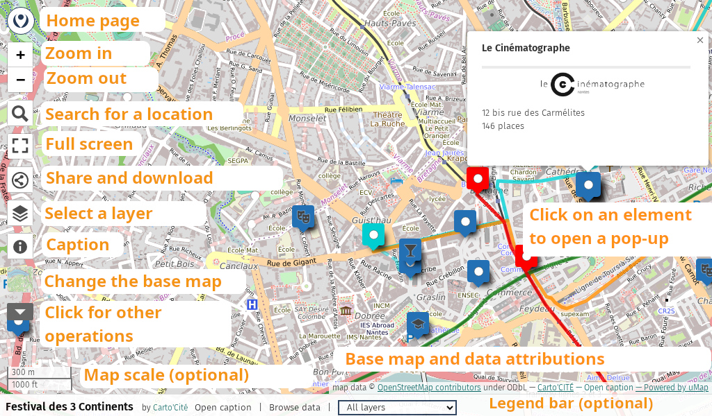
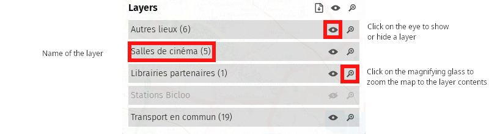
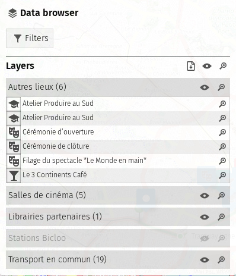

!!! abstract "What you will Learn"

    - Browse a uMap
    - Share a uMap
    - Understand the main features of uMap

## Step-by-step Instructions

### 1. Browse the Map

You have received a link to a uMap by email. Here are the
main elements of the map, and the operations available for the
manipulate. The uMap shown below is available online
[here](http://umap.openstreetmap.fr/en/map/festival-des-3-continents_26381).

To the left of the map, depending on its configuration, you will find
one of the following two panels:

-   **Caption**: the title of the map, an optional description, and
    the list of layers
-   **Browse data**: all the elements of the map,
    distributed by layers (see below)

The caption panel can be displayed or hidden by clicking on the
"About" button (the lowercase letter "i" in a circle) visible at the
left of the map.

As with most interactive maps you can:

-   move the map by dragging and dropping
-   zoom in and out with the + and - buttons, or with the
    mouse wheel
-   select an element of the map by a clicking with the mouse:
    A *popup* wlil appear displaying a description of
    the element. This can include text, an image, or a link to
    a website. In our example, the description of each movie
    theatre contains an image that is a link to its website.

**Note**: the buttons at the left of the map, as well as the
legend bar at the bottom, may not be available if the author of the
map has chosen to hide them.

Now let’s look at some features specific to uMap.

### 2. The Data Browser

The elements of a uMap can be spread across multiple layers.  This
allows you to structure a map, making it clearer and easier to
maintain. The user can choose to display or hide each layer
individually.

<shot-scraper
    data-output="static/tutoriels/control-browse.png"
    data-url="https://umap.openstreetmap.fr/en/map/new/"
    data-alt="Data browser icon."
    data-selector=".umap-control-browse"
    data-width="48"
    data-height="48"
    data-padding="5"
    >Data browser icon.</shot-scraper>

The data browser is the icon visible at the left of the map above the
"About" button.  When you click the this button, the data browser and
list of layers appear.  From here you can filter the elements visible
on the map, display or hide elements by layer, or center the map on
the contents of a layer.

In this example, the “Bicloo Stations” layer is hidden.  Clicking on
the eye next to the layer name allows you to display it.  The list of
layers, possibly including a description of each layer, is also
visible in the caption panel.

### 3. The "More Controls" Button

<shot-scraper
    data-output="static/tutoriels/control-more.png"
    data-url="https://umap.openstreetmap.fr/en/map/new/"
    data-alt="More controls icon."
    data-width="46"
    data-height="33"
    data-selector=".umap-control-more"
    data-padding="5"
    >Icon for displaying more options.</shot-scraper>

At the bottom of the buttons on the left the map, you will find a
button with a triangle and the text "More controls".  Clicking on this
button reveals another series of buttons.

<shot-scraper
    data-output="static/tutoriels/control-search.png"
    data-url="https://umap.openstreetmap.fr/en/map/new/"
    data-alt="Search location icon."
    data-selector=".leaflet-control-search"
    data-width="48"
    data-height="48"
    data-padding="5"
    >Search for a location and center the map on it:
    Type the name of a location and press `Enter`</shot-scraper>

<shot-scraper
    data-output="static/tutoriels/control-fullscreen.png"
    data-url="https://umap.openstreetmap.fr/en/map/new/"
    data-alt="Full screen icon."
    data-selector=".leaflet-control-fullscreen"
    data-width="48"
    data-height="48"
    data-padding="5"
    >Enters full screen mode, which you can leave with the same
    button or with by pressing the Escape key.</shot-scraper>

<shot-scraper
    data-output="static/tutoriels/control-embed.png"
    data-url="https://umap.openstreetmap.fr/en/map/new/"
    data-alt="Share and download icon."
    data-selector=".leaflet-control-embed"
    data-width="48"
    data-height="48"
    data-padding="5"
    >Allows you to share the map or export the data.
    See below for a description of the "Share and download" panel.</shot-scraper>

<shot-scraper
    data-output="static/tutoriels/control-locate.png"
    data-url="https://umap.openstreetmap.fr/en/map/new/"
    data-alt="Center map on your location icon.."
    data-selector=".leaflet-control-locate"
    data-width="48"
    data-height="48"
    data-padding="5"
    data-javascript="document.querySelector('.umap-control-more').click()"
    >
    Allows you to geolocate the map, i.e. center it on your current location.
    Geolocation requires the user's explicit permission, so your browser
    may ask you to for access to your location.
</shot-scraper>

<shot-scraper
    data-output="static/tutoriels/measure-control.png"
    data-url="https://umap.openstreetmap.fr/en/map/new/"
    data-alt="Measure distances icon."
    data-selector=".leaflet-measure-control"
    data-width="48"
    data-height="48"
    data-padding="5"
    data-javascript="document.querySelector('.umap-control-more').click()"
    >
    Measuring tool.  Activating this tool has two effects: it displays
    the length of linear elements of the map and the area of the
    elements' surface; as well, it allows you to trace a line on the
    map and shows the length of this line. Click the button again to
    disable this tool.
</shot-scraper>

<shot-scraper
    data-output="static/tutoriels/control-edit-in-osm.png"
    data-url="https://umap.openstreetmap.fr/en/map/new/"
    data-alt="Edit OpenStreetMap data icon."
    data-selector=".leaflet-control-edit-in-osm"
    data-width="48"
    data-height="48"
    data-padding="5"
    data-javascript="document.querySelector('.umap-control-more').click()"
    >
    Can be used to edit the underlying OpenStreetMap data.
</shot-scraper>

<shot-scraper
    data-output="static/tutoriels/control-icon-layers.png"
    data-url="https://umap.openstreetmap.fr/en/map/new/"
    data-alt="Change background map icon."
    data-selector=".leaflet-iconLayers"
    data-width="48"
    data-height="48"
    data-padding="5"
    data-javascript="document.querySelector('.umap-control-more').click()"
    >
    Displays possible background map styles as thumbnails:
    Clicking on one of them changes the background map.</shot-scraper>

#### Share the map

The map sharing panel, displayed when clicking the "Share and
download" button, offers three possibilities. Your choice depends on
how you want to share the map:

-   **Short link** allows you to copy an shortened URL - equivalent to
    the URL of the map - which you can for example send in an
    email.
-   **Embed in iframe** allows you to embed the map in a
    web page: just copy the HTML code and insert it into
    your web page. This possibility is explored in detail
    in the
    [Publishing and Permissions](7-publishing-and-permissions.md) tutorial.
-   **Download data** allows you to obtain visible data
    on the map, in different formats. This can allow you
    use this data with another tool.

### 4. Visualize the data

Clicking on the "Open browser" button shows the data browser.  You may
also be able to access it from the "Browse data" link in the legend
panel at the bottom of the map, if the map's creator has enabled it.

The data browser shows all the elements of the map, organized by
layers. Clicking on a layer expands or collapses the list of items
contained by it.  You may also filter the visible items by clicking on
the "Filters" icon and entering a search string in the text box.

The magnifying glass to the left of each element allows to
display on the map the popup describing this element. The text of
input above the list allows you to search for an item, by showing that
those whose name contains the text entered.

## Recap

This first tutorial allowed us to discover the main ones
features of a uMap. Next, we will
[learn how to create a uMap](2-first-map.md).

??? info "License"

    Work initiated by Antoine Riche on [Carto’Cité](https://wiki.cartocite.fr/doku.php?id=umap:10_-_j_integre_des_donnees_distantes) under license [CC-BY-SA 4](https://creativecommons.org/licenses/by-sa/4.0/deed.en).
    Translation by Jamie Gaehring and David Huggins-Daines
