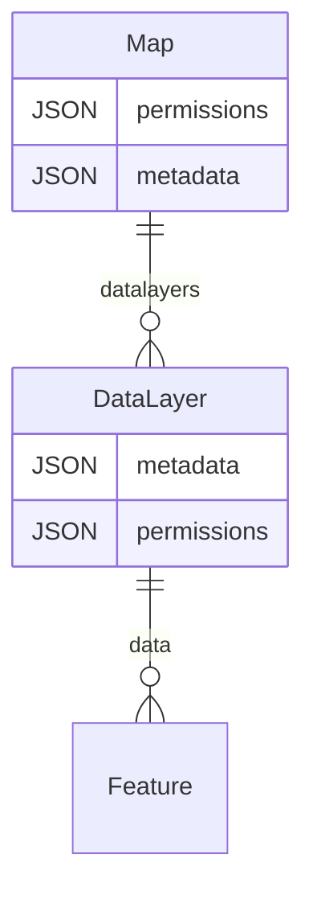

# The frontend

uMap is using Leaflet on the frontend. It's actually extending it: each uMap object extends the ones from Leaflet.

Here are the important concepts and files:

- `umap.js` contains `Map`, the map object. It's the main entry point, which references all the related properties. It contains metadata, permissions, and data layers.
- `umap.layer.js` contains `DataLayer`, which contains metadata, permissions, and data.
- `umap.permissions.js` handles the permissions of the map. There is a different file handling the permissions of the datalayer:
- `umap.datalayer.permissions.js`.

## Map (`L.U.Map`)

`L.U.Map` is the class that's called by the server templates (in `map_init.html` and `map_fragment.html` used when we display lists of maps, like the homepage).

It contains references to datalayers, and to the controls (the buttons that appears on the map)

To be able to change the way the client behaves, querystring parameters can be used to overload the settings stored in the database. This is useful for instance when using iframes to display the map on a different website.

uMap has an edit mode. If you don't have the rights you cannot save nor edit, you can't edit the permissions as well.

A map contains references to:

- controls
- datalayers

## DataLayers (`L.U.Datalayer`)

The datalayers contains data, and a layer (a way to represent them).

Each data layer contains a "layer", to know what type of layer it is. It's one of:

- Choropleth (`L.U.Layer.Choropleth`)
- Cluster (`L.U.Layer.Cluster`)
- Heat (`L.U.Layer.Heat`)

When the data layers are initialized, they can have two states:
- `loaded`: the object is loaded in memory. At this stage we have access to all the datalayer's metada (name, type, id)
- `dataLoaded` : the data is available to be used, so we can for instance compute the center of the map (when it's dynamic).

- `backupOptions` is here to make it possible to cancel what have been done (using undo). It stores the old settings for the data-layer.

## Storage

To mark what needs to be synced with the server, uMap currently mark objects as "dirty". Something marked as "dirty" has changed on the client, but is not yet saved on the server.

Each map, datalayer and permission objects can be marked as "dirty". When a change is made on an object, it will mark its parent as "dirty" as well, so it can be updated accordingly.

### Saving data to the server with `umap.save()`

Here is what's being done when you call `map.save()`:

1. `map.saveSelf()`, posting `name`, `center` and `settings` to the server, and then
2. calls `permission.save()`, which will post the permissions to the server, and then call back
3. `map.continueSaving()`, which will take the first dirtyLayer and call
4. `datalayer.save()` on it. It does the following:
	1. Post the data (`name`, `displayOnLoad`, `rank`, `settings`, and `geojson`)
	2. Calls `permission.save()`, posting `edit_status` to the server, and then calling `map.continue_saving()` and remove the datalayer from `dirtyDatalayers`.
5. When the `dirtyDatalayers` list is empty, we are done.
