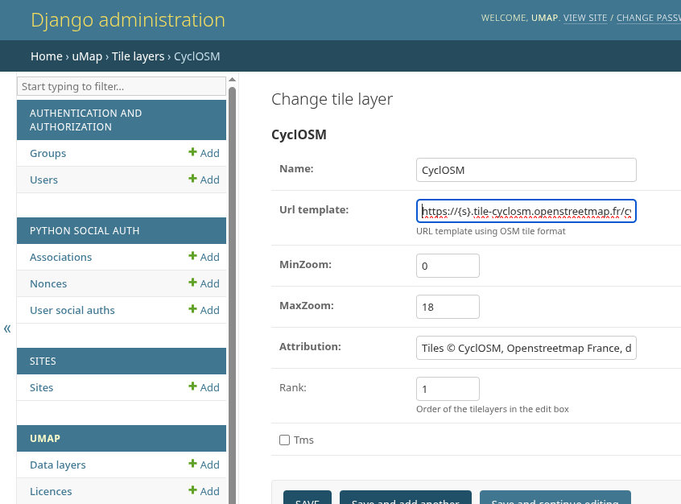

# Administration

uMap uses the built-in [Django administration
site](https://docs.djangoproject.com/en/stable/ref/contrib/admin/) to
manage data and local users, as well as some aspects of configuration
such as [tile layers](#tile-layers).

To access the administration site, open the top-level URL for your
site followed by `/admin`, for instance if your site is
`https://example.com/` then its administration site is
`https://example.com/admin`

## Users and Groups

Although by default, uMap is configured to only allow users to create
accounts using OAuth2 (using their GitHub or OpenStreetMap accounts,
for instance), it is also possible to create and manage local users.

This interface also allows you delete users or to grant elevated
privileges to certain users, to allow them to access the admin
interface for instance.  In normal operation, this may not be
particularly useful.

## Tile Layers

Most importantly, the administration site allows you to add new base
maps (tile layers) and change the order in which they are presented in
the interface.

**IMPORTANT**: Before adding any tile layers, make sure that you have
permission to use them!  See [the OpenStreetMap
Wiki](https://wiki.openstreetmap.org/wiki/Raster_tile_providers) for
more information and a list of available layers.  Each provider will
have its own particular usage policy.

To add a new tile layer, navigate to `/admin/umap/tilelayer/` on your
site, or click on the "Tile Layers" link under the "UMAP" section in
the sidebar.  Then, click on "Add tile layer".  Let's see how this
works by adding [CyclOSM](https://www.cyclosm.org/) to your server:

First, we need to add a name, then the URL template used to access
individual tiles based on geographic position.  The format for this
template is described at the top of the OpenStreetMap ["Raster tile
providers"](https://wiki.openstreetmap.org/wiki/Raster_tile_providers)
wiki page.  (You may also encounter a slightly different format used
in [JOSM](https://josm.openstreetmap.de/wiki/Maps)).

Now, importantly, you **must** also add an attribution text, which is
displayed with the map describing its creator and copyright terms.
You can often find a readymade text in the JOSM maps list, for
instance, for
[CyclOSM](https://josm.openstreetmap.de/wiki/Maps/Worldwide#CyclOSM).

If you wish to restrict the possible zoom levels (or if the provider
does not provide certain zoom levels) you can also enter these here.

Click on "Save".  You should now be able to see and use this tile
layer in all of your maps!

